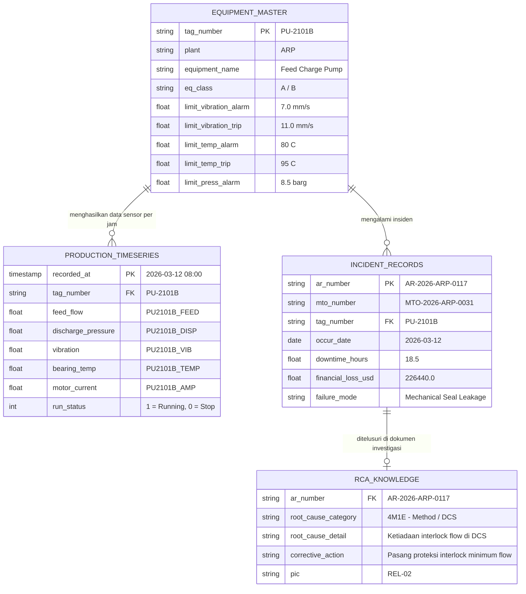
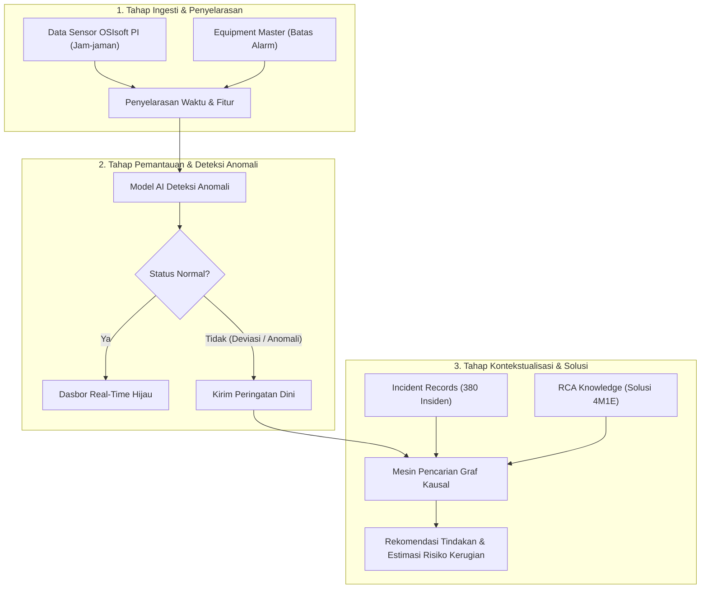

# Arsitektur Pipeline Data: Unified Data Foundation

# 1. Overview

## 1.1 Ringkasan Konsep
Pipeline ini berfungsi menyatukan 4 sumber data heterogen dari pabrik Chandra Asri ke dalam satu skema terpadu (*Unified Data Model*). Keempat data dihubungkan menggunakan dua kunci relasional utama:
1. **`tag_number`** (ID fisik peralatan, contoh: `PU-2101B`, `KO-3201`): Menghubungkan pembacaan sensor, batas ambang alarm, dan daftar insiden.
2. **`ar_number`** (Nomor Abnormality Report, contoh: `AR-2026-ARP-0117`): Menghubungkan baris insiden umum ke dokumen investigasi RCA mendalam.

---

## 1.2 Diagram Relasi Data (Entity-Relationship)

---

## 1.3 4 Entitas Data Utama

| Entitas                     | Sumber Asal                    | Sifat Data               | Peran dalam Sistem                                                                                  |
| :-------------------------- | :----------------------------- | :----------------------- | :-------------------------------------------------------------------------------------------------- |
| **`EQUIPMENT_MASTER`**      | `Equipment Performance`        | Statis / Tabular         | Menyimpan batas desain fisik mesin (batas normal, alarm, dan batas henti/trip).                     |
| **`PRODUCTION_TIMESERIES`** | `Production Data` (OSIsoft PI) | Deret Waktu Kontinu      | Menyimpan angka telemetri sensor per jam untuk dipantau secara langsung oleh AI.                    |
| **`INCIDENT_RECORDS`**      | `Incident Database.xlsx`       | Transaksional / Kejadian | Menyimpan riwayat 380 kegagalan masa lalu lengkap dengan jam downtime dan nilai kerugian finansial. |
| **`RCA_KNOWLEDGE`**         | `RCA - Downtime Data`          | Semi-Terstruktur / Teks  | Menyimpan hasil analisis investigasi 4M+1E dan rekomendasi tindakan perbaikan (CAPA).               |

---

## 1.4 Alur Pipeline Pemrosesan Data

### Rincian Tiap Tahapan:
1. **Tahap Ingesti dan Penyelarasan Waktu:**
   * Membaca tag sensor dari OSIsoft PI melalui API atau konektor berkas time-series.
   * Menghubungkan setiap sinyal sensor ke baris `tag_number` yang sesuai di tabel master untuk mendapatkan batas alarm operasional.
2. **Tahap Deteksi Anomali AI:**
   * Membaca tren multivariat (kombinasi suhu, getaran, tekanan, arus) untuk melihat anomali sebelum alarm batas atas berbunyi.
   * Mengelompokkan status menjadi: Normal, Warning (deviasi tren), dan Critical (mendekati trip).
3. **Tahap Kontekstualisasi dan Rekomendasi Solusi:**
   * Saat anomali terdeteksi pada alat tertentu, sistem mencari insiden historis serupa di tabel riwayat.
   * Sistem menghitung potensi jam mati (*downtime*) dan kerugian uang (*financial loss*).
   * Sistem menarik poin perbaikan (*corrective action*) dari basis data RCA untuk langsung ditampilkan kepada operator dan teknisi lapangan.

---

# 2. Metodologi Entitas: Production Data (OSIsoft PI)

## 2.1 Mekanisme Ingesti (Strategi Dual-Track: POC vs Produksi)
Data ditarik dari OSIsoft PI Server melalui PI Web API / OPC-UA dengan strategi implementasi terbagi dua:
* **Track 1: Implementasi Prototipe / POC Hackathon (Single-Speed Replay):**
  * Menggunakan pemutaran data historis (*chronological data replay*) dengan interval waktu tetap (misal: 1 detik waktu simulasi memproses 1 baris data sensor per jam).
  * Menghindari *race condition* dan kerumitan pengatur waktu (*timer scheduler*) sehingga eksekusi demo dasbor terjamin stabil, cepat, dan bebas kegagalan sistem saat presentasi langsung.
* **Track 2: Arsitektur Skala Penuh untuk Slide Proposal (Adaptive Dual-Speed):**
  * **Mode Normal (Polling 5-10 Menit):** Mengambil data telemetri sensor secara berkala untuk memantau tren operasional tanpa membebani jaringan pabrik dan server historian.
  * **Mode Siaga / Warning (Polling 1 Menit):** Jika model AI mendeteksi deviasi anomali pada alat tertentu, frekuensi tarikan data untuk alat tersebut otomatis dinaikkan ke 1 menit guna memberi waktu reaksi 15-30 menit bagi operator sebelum mesin mengalami trip mekanikal.

## 2.2 Aturan Validasi & Pembersihan (3-Layer Cleansing)
Data mentah disaring melalui 3 lapis validasi sebelum masuk ke penyimpanan:
1. **Lapis 1 (Batas Fisika Instrumen):** Menolak data di luar batas instrumen (*span*) dari tabel `PI Tag` (misal nilai suhu di bawah nol mutlak atau tekanan melebihi batas desain bejana).
2. **Lapis 2 (Integritas Sinyal & Sensor Macet):** Mendeteksi *frozen tag* jika angka sensor bernilai konstan (variansi = 0) selama lebih dari 4 jam berturut-turut saat status mesin aktif (`RUN_STATUS = 1`). Data kosong < 2 jam diisi dengan interpolasi linier; data kosong > 2 jam diisolasi.
3. **Lapis 3 (Isolasi Transien Operasional):** Menandai periode 30 menit saat terjadi lonjakan drastis pada `PLANT_RATE` agar perubahan beban normal saat pergantian tangki umpan tidak memicu alarm palsu.

## 2.3 Rekayasa Fitur untuk Model AI (Load-Normalized Features)
Sensor mentah ditransformasikan menjadi parameter berbasis beban kimia dan fisika proses:
* **Normalisasi Beban Pabrik:** Membagi nilai sensor getaran dan temperatur dengan laju produksi riil (`PLANT_RATE`) untuk menghasilkan rasio beban spesifik.
* **Laju Perubahan Dinamis ($dx/dt$):** Menghitung turunan waktu untuk mendeteksi percepatan laju kenaikan suhu bantalan atau vibrasi pompa.
* **Fitur Fisika Proses Kimia:** Menghitung selisih tekanan ($\Delta P$) untuk mendeteksi pembentukan kerak (*fouling*) pada penukar panas.

## 2.4 Model Deteksi Anomali: GDN (Solusi Utama) & DCdetector (Alternatif)

### 2.4.1 Solusi Utama: Graph Deviation Network (GDN)
Model deteksi anomali utama yang diajukan adalah **Graph Deviation Network (GDN)** ([arXiv:2106.06947](https://arxiv.org/abs/2106.06947)):
* **Pemodelan Topologi Sensor:** Memperlakukan sensor instrumen (`FEED`, `DISP`, `VIB`, `TEMP`, `AMP`) sebagai simpul (*nodes*) dalam sebuah graf yang terhubung mengikuti alur pipa fisik.
* **Deteksi Deviasi Relasi Spasial:** Bukan sekadar memantau nilai ambang batas statis, GDN mendeteksi anomali saat hubungan antar-sensor menyimpang dari struktur graf normal (contoh: laju alir masuk turun mendadak tetapi arus motor tetap tinggi saat kavitasi pompa).
* **Transparansi Visual (*Explainability*):** Sistem mampu menunjukkan secara visual garis relasi spesifik yang menyimpang di dasbor, sehingga langsung dapat dicocokkan dengan diagram P&ID oleh rekan Teknik Kimia.

### 2.4.2 Solusi Alternatif: DCdetector (Dual-Attention Contrastive Learning)
Sebagai alternatif model komputasi deret waktu murni berkecepatan tinggi, diajukan **DCdetector** ([arXiv:2306.10347](https://arxiv.org/abs/2306.10347)):
* **Dual-Attention Multi-Skala:** Membandingkan pola data waktu dari dua sudut pandang sekaligus (lensa makro 24 jam vs lensa mikro 15 menit).
* **Pembelajaran Kontras Tanpa Rekonstruksi:** Mengukur perbedaan kontras pola anomali secara instan tanpa perlu merekonstruksi nilai asli sensor, sehingga jauh lebih hemat memori dan komputasi dibanding arsitektur transformer standar.
* **Peran Penggunaan:** Dipilih apabila infrastruktur server kilang membutuhkan pemrosesan puluhan ribu titik sensor deret waktu secara serentak dengan beban komputasi paling ringan.

## 2.5 Arsitektur Penyimpanan & Partisi (TimescaleDB Hypertables)
Data deret waktu disimpan menggunakan mesin **TimescaleDB** (ekstensi PostgreSQL):
* **Hypertables:** Tabel `PRODUCTION_TIMESERIES` otomatis dipartisi per 7 hari berdasarkan kolom `recorded_at` (`TIMESTAMPTZ`).
* **Pengindeksan BRIN:** Menggunakan *Block Range Index* (BRIN) pada kolom waktu untuk menjaga ukuran indeks tetap sangat kecil dan kueri rentang waktu tetap cepat.
* **Kompresi Kolumnar:** Mengaktifkan kompresi bawaan setelah data berumur > 14 hari untuk menghemat ruang disk hingga 90%.
* **Konektivitas Relasional Langsung:** Data sensor dapat di-JOIN langsung dengan tabel `EQUIPMENT_MASTER` dan `INCIDENT_RECORDS` dalam satu kueri SQL standar tanpa jembatan API terpisah.

---

# 3. Metodologi Entitas: Equipment Master (EQUIPMENT_MASTER)

## 3.1 Pembagian Tugas Tim (Teknik Kimia vs Teknik Komputer)
Pengolahan data master peralatan dibagi tegas berdasarkan keahlian domain:
* **Peran Tim Teknik Kimia (2 Rekan Tim):**
  * *Batas Fisik & Termodinamika:* Membedah lembar spesifikasi teknis (*datasheet*) untuk menentukan batas operasi aman (*Safe Operating Limits*), batas alarm, dan batas trip pada getaran, temperatur bantalan, tekanan buang, dan laju pelumasan.
  * *Logika Interlock P&ID:* Memetakan variabel proses mana yang langsung memicu pematian mesin otomatis (*Class A trip*) vs variabel yang hanya menurunkan efisiensi.
  * *Pembobotan Bahaya ($w_i$):* Menetapkan bobot risiko kegagalan fisik (misal getaran lebih diutamakan untuk pompa sentrifugal dibanding kompresor gas).
* **Peran Tim Teknik Komputer (Azka):**
  * *Skema Tabel Relasional:* Merancang tabel `EQUIPMENT_MASTER` di PostgreSQL dengan aturan integritas ketat (`Normal < Alarm < Trip`).
  * *Mesin Indeks Kesehatan Real-Time:* Mengembangkan algoritma kalkulasi skor kesehatan mesin (*Weighted Health Index*) 0-100% yang dievaluasi tiap menit.
  * *Arsitektur Caching Berkecepatan Tinggi:* Mengintegrasikan Redis In-Memory Cache agar model AI dapat membaca batas ambang dalam hitungan sub-milidetik.

## 3.2 Ingesti dan Validasi Integritas Batas Fisik
* **Mekanisme Ingesti:** Pemuatan berkala (*batch load*) dari dokumen spesifikasi peralatan (`Equipment Performance - RCA*.xlsx`) dan sistem manajemen aset pabrik.
* **Validasi Integritas Data:**
  * Penerapan aturan *CHECK constraint* di basis data: `limit_normal < limit_alarm < limit_trip`.
  * Sistem otomatis menolak input jika batas alarm disetel lebih tinggi atau sama dengan batas trip darurat.

## 3.3 Mesin Indeks Kesehatan Dinamis (Weighted Health Index)
Kesehatan mesin dihitung secara real-time menggabungkan pembobotan dari rekan Teknik Kimia dengan deviasi sensor aktual:
1. **Rasio Deviasi Parameter ($d_i$):**
   $$d_i(t) = \max\left(0, \frac{\text{Sensor}_i(t) - \text{Normal}_i}{\text{Trip}_i - \text{Normal}_i}\right)$$
2. **Skor Kesehatan Total Mesin (0 - 100%):**
   $$\text{Health Index}(t) = \max\left(0, 100\% \times \left(1 - \sum_{i} w_i \cdot d_i(t)\right)\right)$$
3. **Kategori Status Dasbor Otomatis:**
   * **Normal (Hijau):** Health Index $> 85\%$ (beroperasi stabil di batas aman).
   * **Warning (Kuning):** Health Index $60\% - 85\%$ (deviasi terdeteksi, perlu pengawasan operator).
   * **Critical (Merah):** Health Index $< 60\%$ (mendekati trip, butuh tindakan mitigasi segera).

## 3.4 Arsitektur Penyimpanan & Caching (PostgreSQL + Redis)
* **Penyimpanan Permanen (PostgreSQL):** Tabel relasional menyimpan catatan master mesin dengan primary key `tag_number`.
* **In-Memory Caching (Redis):** Batas ambang aman mesin disalin ke dalam Redis Cache (*Key-Value Store*) agar model AI (GDN/DCdetector) dapat membandingkan nilai sensor ribuan kali per detik tanpa membebani disk basis data relasional.
* **Sinkronisasi Otomatis:** Jika tim pemeliharaan mengubah nilai batas di PostgreSQL, sistem menggunakan *database trigger* untuk memperbarui data di Redis secara instan (*cache invalidation*).

## 3.5 Landasan Ilmiah & Standar Industri
Metodologi penentuan batas dan kalkulasi indeks kesehatan ini berlandaskan pada dua rujukan utama:
* **Paper Ilmiah (Kalkulasi Health Index):** [Health Index Estimation via Domain Knowledge (arXiv:2405.04990)](https://arxiv.org/abs/2405.04990) (*Reliability Engineering & System Safety*, 2024) yang membuktikan keandalan perumusan indeks kesehatan mesin 0-100% dengan menyematkan batas rekayasa fisik (*inductive bias*) ke dalam model tanpa pengawasan (*unsupervised*).
* **Standar Industri Internasional (Batas Ambang Fisik):** **ISO 10816-3 / ISO 20816 (Mechanical Vibration Standard)** yang menjadi acuan resmi Chandra Asri dan tim Teknik Kimia dalam mematok batas alarm getaran (7.0 mm/s) dan batas trip (11.0 mm/s) untuk pompa sentrifugal dan mesin berputar Kelas B.

---

# 4. Metodologi Entitas: Incident Records (INCIDENT_RECORDS)

## 4.1 Pembagian Tugas Tim (Teknik Kimia vs Teknik Komputer)
Pengolahan 380 data insiden historis ($59.73M total kerugian) dibagi menjadi dua ranah kerja:
* **Peran Tim Teknik Kimia (2 Rekan Tim):**
  * *Validasi Mekanisme Kerusakan Fisik (`F Mechanism`):* Memverifikasi keabsahan kavitasi, pengotoran (*fouling*), keausan mekanikal, atau tegangan termal pada 380 kasus agar sesuai hukum kimia proses.
  * *Taksonomi Komponen Kritis (`Component`):* Mengelompokkan komponen yang sering rusak (*mechanical seal*, bantalan, pipa penukar panas, impeler) ke dalam hierarki suku cadang kritis.
  * *Penilaian Dampak Proses & HSE:* Menentukan tingkat keparahan risiko kualitatif (*Risk Score*) terhadap bahaya keselamatan kilang, kebocoran gas, dan pembakaran emisi suar (*flaring loss*).
* **Peran Tim Teknik Komputer (Azka):**
  * *Skema Relasional & Indeks Komposit:* Merancang tabel `INCIDENT_RECORDS` di PostgreSQL dengan indeks pencarian cepat pada `(tag_number, plant, occur_date)`.
  * *Mesin Penaksir Risiko Finansial Real-Time (Hierarchical Matching Engine):* Membangun logika otomatis saat sensor menyimpang untuk mengestimasi potensi jam mati dan kerugian dolar jika mesin tidak ditangani.
  * *Mesin Agregasi Problem Tank (Dual-Axis Pareto):* Mengembangkan modul komputasi dasbor untuk memilah insiden berulang (*chronic bad actors*) vs insiden katastropik bernilai jutaan dolar.

## 4.2 Ingesti dan Validasi Integritas Data Riwayat
* **Mekanisme Ingesti:** Pemuatan berkala (*batch load*) dari berkas transaksional `Incident Database.xlsx` atau sinkronisasi modul pemeliharaan SAP CMMS / MTO.
* **Pembersihan & Validasi Integritas:**
  * Penyeragaman format tanggal `YYYY-MM-DD`.
  * Pembersihan entri kosong (`n/a`) pada kolom nomor laporan investigasi `AR No.`.
  * Pemeriksaan batas validitas angka: nilai `Downtime (hrs)` dan `Total Loss (k US$)` tidak boleh bernilai negatif ($>= 0$).

## 4.3 Mesin Penaksir Risiko Finansial Real-Time (Hierarchical Matching)
Ketika model AI (GDN) mendeteksi anomali pada sensor mesin, sistem secara otomatis menaksir potensi kerugian finansial menggunakan logika pencocokan 3 tingkat:
* **Tingkat 1 (Persis ID Alat):** Mencari riwayat insiden dengan `tag_number` yang identik (misal `PU-2101B`). Jika ditemukan, sistem menampilkan riwayat downtime historis (18.5 jam) dan kerugian aktual ($226.4k).
* **Tingkat 2 (Fallback Komponen Sejenis di Pabrik Sama):** Jika alat tersebut belum pernah rusak (misal `PU-2101A`), sistem menghitung nilai tengah (*median*) kerugian dari komponen dan jenis alat yang sama di unit pabrik terkait (misal seluruh pompa sentrifugal di plant ARP).
* **Tingkat 3 (Fallback Seluruh Kilang):** Mengambil rata-rata historis kelas alat sejenis dari 12 unit pabrik Chandra Asri.

## 4.4 Mesin Analisis Pareto & Problem Tank (Dual-Axis Matrix)
380 insiden masa lalu dipetakan secara dinamis ke dalam matriks kuadran pada modul *Problem Tank*:
* **Kuadran 1: Catastrophic Trip Guard (Frekuensi Rendah, Dampak Sangat Tinggi):**
  * Memantau aset kritis Kelas A seperti kompresor gas retak `KO-3201` (kerugian $1.58M per trip). Fokus mitigasi: pencegahan trip total via interlock protektif.
* **Kuadran 2: Chronic Problem Tank (Frekuensi Tinggi, Dampak Akumulatif Masif):**
  * Mengelompokkan kegagalan berulang bernilai $50k-$200k yang menyumbang mayoritas kerugian pabrik (seperti kebocoran *mechanical seal* pompa dan *fouling* penukar panas berkala).
* **Fitur Filter Interaktif:** Pengguna dasbor dapat menyaring visualisasi Pareto berdasarkan Plant (12 pabrik), Disiplin (Rotary, Static, Electrical, Instrument), dan Jenis Komponen.

## 4.5 Arsitektur Penyimpanan & Pengindeksan (PostgreSQL)
* **Penyimpanan Relasional:** Disimpan pada tabel `INCIDENT_RECORDS` di PostgreSQL.
* **Pengindeksan B-Tree Multi-Kolom:** Menggunakan indeks komposit `CREATE INDEX idx_incident_search ON INCIDENT_RECORDS (tag_number, plant, occur_date)` untuk memastikan kueri penaksir kerugian selesai dalam waktu kurang dari 5 milidetik.

## 4.6 Landasan Ilmiah Terverifikasi
* **Pelacakan Akar Masalah Berbasis Alarm & Insiden Industri:** [Alarm-Based Root Cause Analysis in Industrial Processes (arXiv:2203.11321)](https://arxiv.org/abs/2203.11321) untuk metodologi pemodelan urutan alarm dan riwayat insiden menggunakan representasi embedding guna melacak pemicu utama kegagalan.
* **Ontologi dan Analisis Risiko Kegagalan (FMEA-KG):** [Knowledge Graph Enhanced FMEA for Manufacturing (arXiv:2406.18114)](https://arxiv.org/abs/2406.18114) (*Journal of Industrial Information Integration*, 2025) untuk standarisasi taksonomi komponen mesin, mekanisme kegagalan, dan penentuan prioritas risiko pada rantai manufaktur.

---

# 5. Metodologi Entitas: RCA & Downtime Knowledge (RCA_KNOWLEDGE)

## 5.1 Pembagian Tugas Tim (Teknik Kimia vs Teknik Komputer)
Pengolahan 5 dokumen investigasi mendalam RCA dan tindakan perbaikan dibagi menjadi dua peran:
* **Peran Tim Teknik Kimia (2 Rekan Tim):**
  * *Verifikasi 4M+1E & Fenomena Fisik:* Memeriksa keabsahan ilmiah dari akar masalah kimia/mekanikal (contoh: kavitasi akibat pergantian tangki umpan, pengotoran kokas coking, atau minyak terdegradasi).
  * *Penyusunan Prosedur Mitigasi Standar:* Merumuskan langkah tindakan darurat (*immediate containment action*) dan mitigasi permanen (*CAPA*) yang realistis dan aman dijalankan operator kilang.
* **Peran Tim Teknik Komputer (Azka):**
  * *Ekstraksi Dokumen Terstruktur (JSON/PostgreSQL):* Mengubah berkas presentasi PPTX yang tidak terstruktur menjadi format data relasional graf yang bersih.
  * *Mesin Graph-RAG Terpandu:* Menghubungkan anomali sensor dan catatan insiden ke dokumen mitigasi teknis menggunakan panggilan LLM berbasis bukti operasional.
  * *Desain Antarmuka Kartu Aksi (*Action Card*):* Merancang komponen UI dasbor yang menyajikan ringkasan tindakan, nama PIC, status, dan tenggat waktu secara instan.

## 5.2 Strategi Ekstraksi Dokumen (Lightweight Structured Graph)
Untuk implementasi prototipe yang cepat dan bebas kegagalan *chunking*, 5 dokumen RCA diekstraksi ke dalam satu struktur skema terpadu (`rca_knowledge.json` atau tabel relasional):
* **Struktur Data Entitas:**
  * `tag_number`: Kunci primer relasi alat (misal `PU-2101B`).
  * `failure_phenomenon`: Gejala kegagalan (misal *Mechanical Seal Leakage*).
  * `root_cause_4m1e`: Akar masalah sistemik (misal *Ketiadaan interlock flow di DCS*).
  * `immediate_action`: Tindakan cepat operator (misal *Buka valve bypass HV-2101*).
  * `permanent_capa`: Tindakan perbaikan permanen (misal *Pasang interlock minimum flow*).
  * `pic_role`: Penanggung jawab resmi (misal *REL-02 / Reliability Engineer*).

## 5.3 Arsitektur Graph-RAG untuk Follow-up Action Recommendation
Alur penalaran dari alarm sensor hingga menjadi rekomendasi tindakan konkret:
1. **Trigger:** Model GDN mendeteksi anomali korelasi sensor pada suatu mesin.
2. **Context Retrieval:** Sistem mengambil profil batas aman dari `EQUIPMENT_MASTER`, riwayat kegagalan dari `INCIDENT_RECORDS`, dan paket solusi terstruktur dari `RCA_KNOWLEDGE`.
3. **Evidence-Grounded Prompting:** Sistem memanggil LLM dengan konteks terisolasi: *"Berdasarkan akar masalah dan tindakan resmi ini, susun panduan mitigasi ringkas untuk operator"*.
4. **Zero-Hallucination Output:** Output teks terkunci 100% pada dokumen resmi pabrik Chandra Asri tanpa karangan liar dari AI.

## 5.4 Format Kartu Rekomendasi Tindakan (Action Card di Dasbor)
Kartu tugas interaktif yang muncul di dasbor operator:
* **Header:** Kode Alat (`PU-2101B`) | Tingkat Risiko (`High / Class B`) | Status Tindakan (`Assigned`).
* **Ringkasan Akar Masalah:** Indikasi kavitasi dan putaran kering akibat penurunan aliran umpan.
* **Langkah Aksi Segera (Operator Lapangan):** Periksa level tangki umpan dan buka bypass valve HV-2101.
* **Tindakan Lanjutan (Engineering):** Koordinasikan dengan tim instrumen (PIC REL-02) untuk penambahan interlock di DCS sebelum tanggal tenggat waktu.

## 5.5 Landasan Ilmiah Terverifikasi
* **Integrasi Graf Pengetahuan dengan RAG Industri:** [Knowledge Graph Enhanced RAG for FMEA (arXiv:2406.18114)](https://arxiv.org/abs/2406.18114) (*Journal of Industrial Information Integration*, 2025) untuk metodologi penautan data kegagalan ke dalam graf terstruktur guna penarikan konteks bebas halusinasi.
* **Penalaran Berbasis Bukti Nyata untuk Akar Masalah Industri:** [Agentic Root Cause Analysis via Evidence-Grounded Reasoning (arXiv:2607.22385)](https://arxiv.org/abs/2607.22385) untuk kerangka kerja perumusan rekomendasi tindakan mitigasi berbasis fakta operasional kilang.

# Referensi Ilmiah Terverifikasi (arXiv)
* **Penalaran Berbasis Bukti Nyata untuk Akar Masalah Industri:** [Agentic Root Cause Analysis via Evidence-Grounded Reasoning (arXiv:2607.22385)](https://arxiv.org/abs/2607.22385) untuk kerangka kerja perumusan rekomendasi tindakan mitigasi berbasis fakta operasional kilang.
* **Ontologi dan Analisis Risiko Kegagalan (FMEA-KG / Graph-RAG):** [Knowledge Graph Enhanced FMEA for Manufacturing (arXiv:2406.18114)](https://arxiv.org/abs/2406.18114) (*Journal of Industrial Information Integration*, 2025) untuk standarisasi taksonomi komponen mesin, mekanisme kegagalan, dan arsitektur RAG industri terstruktur.
* **Pelacakan Akar Masalah Berbasis Alarm & Insiden Industri:** [Alarm-Based Root Cause Analysis in Industrial Processes (arXiv:2203.11321)](https://arxiv.org/abs/2203.11321) untuk metodologi korelasi log alarm dengan riwayat kegagalan operasional.
* **Deteksi Anomali Berbasis Graf Relasi Sensor (GDN - Solusi Utama):** [Graph Deviation Network (arXiv:2106.06947)](https://arxiv.org/abs/2106.06947) untuk memetakan hubungan fisik antar-sensor proses kimia dan mendeteksi deviasi relasi topologis secara transparan.
* **Deteksi Anomali Deret Waktu Kontras Cepat (DCdetector - Alternatif):** [DCdetector (arXiv:2306.10347)](https://arxiv.org/abs/2306.10347) untuk deteksi anomali multi-skala waktu super cepat berbasis contrastive learning tanpa beban rekonstruksi data.
* **Pemodelan Indeks Kesehatan dan Degradasi Aset Industri:** [Health Index Estimation via Domain Knowledge (arXiv:2405.04990)](https://arxiv.org/abs/2405.04990) untuk metodologi perumusan indikator kesehatan mesin (0-100%) dengan menggabungkan batas fisik rekayasa ke dalam model tanpa pengawasan.
* **Integrasi Batasan Fisika Proses Kimia:** [Physics-Informed ML for Chemical Processes (arXiv:2209.07248)](https://arxiv.org/abs/2209.07248) untuk memastikan parameter operasi dan degradasi mematuhi hukum termodinamika.
* **Deteksi Anomali Sinyal Sensorik Gabungan:** [Anomaly Transformer (arXiv:2110.02642)](https://arxiv.org/abs/2110.02642) untuk mendeteksi perubahan hubungan antar-variabel sensor proses tanpa memerlukan banyak data kegagalan berlabel.
* **Analisis Variasi Multi-Periodik Sensor:** [TimesNet (arXiv:2210.02186)](https://arxiv.org/abs/2210.02186) untuk pemodelan deret waktu proses kimia yang memiliki siklus beban berubah-ubah.
* **Integrasi Data Numerik ke Graf Pengetahuan Solusi Industri:** [Knowledge Graph for Root Cause Analysis (arXiv:2311.16239)](https://arxiv.org/abs/2311.16239) untuk menghubungkan anomali sensor ke dokumen investigasi perbaikan.
* **Pelacakan Hubungan Sebab-Akibat Kerusakan Mesin:** [Causal Discovery in Process Data (arXiv:2204.04804)](https://arxiv.org/abs/2204.04804) untuk memastikan rekomendasi perbaikan sesuai alur sebab-akibat fisik.
* **Tolok Ukur Uji Pemrosesan Data Pabrik Kimia:** [Tennessee Eastman Process Benchmark (arXiv:2303.05904)](https://arxiv.org/abs/2303.05904) sebagai acuan validasi algoritma kontrol dan monitoring industri kimia.

## Related Notes
* [[dump__ide]]
* [[temp]]
