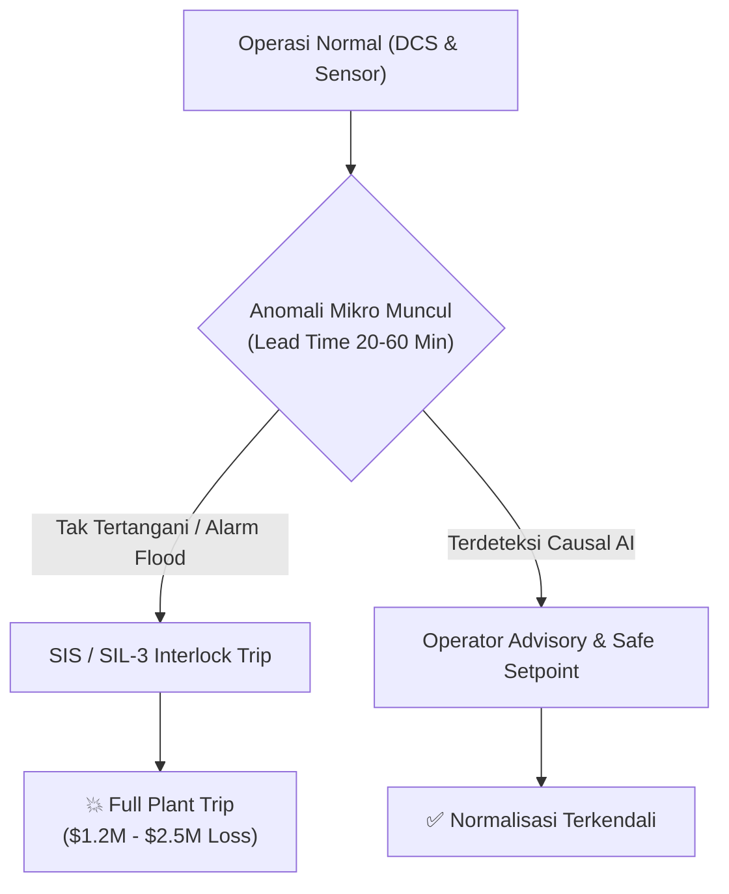

# Masalah 1: Mitigasi Unplanned Plant Trip pada Steam Cracker
**Project Context:** CALIBER 2026 — PT Chandra Asri Pacific Tbk  
**Fokus Area:** Deteksi Dini Anomali Multivariat, Causal RCA, & Pengurangan Alarm Flood  
**Epistemic Framework:** `[FACT]` (Data/Standar Industri), `[ASSUMPTION]` (Operasional), `[HYPOTHESIS]` (Ide/Inovasi Anda).

---

## 1. Baseline Masalah & Dampak Finansial

| Parameter Operasional | Nilai Baseline Industri |
| :--- | :--- |
| **Frekuensi Insiden** | 1–3x Full Trip/Tahun \| 5–10x Partial Trip/Tahun |
| **Dampak Finansial** | $1.2M – $2.5M per kejadian ($500k loss margin + $400k flaring/thermal) |
| **Lead Time Deteksi** | Anomali mikro muncul 20–60 menit sebelum SIS interlock |
| **Beban Operator** | 1.200–3.500 alarm/hari (*cognitive overload* / alarm flood) |

* `[FACT]` **Safety Boundary:** Intervensi kontrol AI tidak boleh mem-bypass sistem interlock keselamatan hardware *SIL-3*.
* `[FACT]` **Akar Kebutuhan:** Operator butuh sistem *early warning* yang mampu membedakan akar masalah (*root cause*) vs gejala turunan (*symptoms*).

---

## 2. Jangkar Literatur Ilmiah (arXiv Hub)

| Pendekatan Algoritma | Model Rujukan | Paper arXiv | Fokus Kegunaan |
| :--- | :--- | :--- | :--- |
| **Multivariate Anomaly Detection** | *Anomaly Transformer* *TimesNet 2D* | [`arXiv:2110.02642`](https://arxiv.org/abs/2110.02642) [`arXiv:2210.02186`](https://arxiv.org/abs/2210.02186) | Deteksi deviasi pola korelasi sensor DCS sebelum alarm batas ambang berbunyi. |
| **Causal Root-Cause Analysis** | *Causally Guided Transformer* *FaultExplainer ReAct* | [`arXiv:2604.17998`](https://arxiv.org/abs/2604.17998) [`arXiv:2412.14492`](https://arxiv.org/abs/2412.14492) | Memetakan graf propagasi fault dan mengeliminasi *alarm storm*. |
| **Chemical Process Benchmark** | *Tennessee Eastman Process (TEP)* | [`arXiv:2303.05904`](https://arxiv.org/abs/2303.05904) | Verifikasi ketahanan model terhadap 20 mode gangguan proses kimia. |
| **Physics-Informed Control** | *Stiff-PINN Process Control* | [`arXiv:2011.04520`](https://arxiv.org/abs/2011.04520) [`arXiv:2507.22640`](https://arxiv.org/abs/2507.22640) | Menjamin rekomendasi setpoint mematuhi hukum termodinamika & massa. |

---

## 3. Ide & Hipotesis Solusi (Sandbox)

*Gunakan bagian ini untuk menuangkan ide awal, arsitektur, atau mekanisme solusi yang ingin diajukan.*

### A. Konsep Inti & Nilai Unik Solusi
* `[HYPOTHESIS]` **Nama Ide / Solusi:** *(Tulis nama atau branding solusi di sini)*
* `[HYPOTHESIS]` **Mekanisme Kerja:** *(Jelaskan alur dari penerimaan data telemetry DCS hingga rekomendasi sampai ke operator)*
* `[HYPOTHESIS]` **Diferensiasi:** *(Mengapa pendekatan ini lebih unggul dibanding DCS/SCADA konvensional bawaan pabrik?)*

### B. Arsitektur Teknis & Integrasi OT/IT
* `[HYPOTHESIS]` **Sumber Data:** *(Sensor TMT furnace, tekanan steam header, getaran kompresor, log alarm ISA-18.2).*
* `[HYPOTHESIS]` **Engine Pemrosesan:** *(Edge deployment on-premise vs AI agentic reasoning).*
* `[HYPOTHESIS]` **Guardrail Keamanan:** *(Read-only data diode, human-in-the-loop advisory, bounded setpoint limits).*

### C. Proyeksi Dampak Bisnis
* `[HYPOTHESIS]` **Target EBITDA:** *(Pencegahan 1x full trip = $1.5M+ saving per tahun).*
* `[HYPOTHESIS]` **Kecepatan Respon:** *(Pemotongan Mean Time to Triage operator dari 45 menit ke < 5 menit).*

---

## 4. Red-Teaming & Checklist Juri

- [ ] `[ASSUMPTION]` Apakah solusi aman dari risiko halusinasi model AI (*Safety Integrity & Fail-Safe*)?
- [ ] `[FACT]` Bagaimana menangani pergeseran data (*concept drift*) saat komposisi umpan *Naphtha* berubah?
- [ ] `[ASSUMPTION]` Apakah komputasi *edge* di kilang mampu memproses puluhan ribu *tags* DCS per detik tanpa latensi?
- [ ] `[FACT]` Bagaimana membuktikan ROI finansial jika dalam satu tahun tidak terjadi trip sama sekali?

---

# Masalah 2: [Judul Masalah Berikutnya]
**Project Context:** CALIBER 2026 — PT Chandra Asri Pacific Tbk  
**Fokus Area:** *(Contoh: Digitalisasi P&ID Knowledge Hub / Optimasi Energi Furnace / Logistik Multi-Hub Cilegon-Bukom)*  
**Epistemic Framework:** `[FACT]` (Data/Standar Industri), `[ASSUMPTION]` (Operasional), `[HYPOTHESIS]` (Ide/Inovasi Anda).

---

## 1. Baseline Masalah & Dampak Finansial
* `[FACT]` **Deskripsi Masalah:** 
* `[FACT]` **Pain Point Operasional:** 
* `[ASSUMPTION]` **Estimasi Kerugian / Potensi Inefisiensi:** 

## 2. Jangkar Literatur Ilmiah (arXiv Hub)
* `[FACT]` **Paper Rujukan:** 

## 3. Ide & Hipotesis Solusi (Sandbox)
* `[HYPOTHESIS]` **Nama Ide / Pendekatan:** 
* `[HYPOTHESIS]` **Mekanisme Kerja:** 
* `[HYPOTHESIS]` **Dampak & Nilai Tambah:** 

## 4. Red-Teaming & Checklist Juri
- [ ] `[ASSUMPTION]` Pertanyaan kritis juri...
