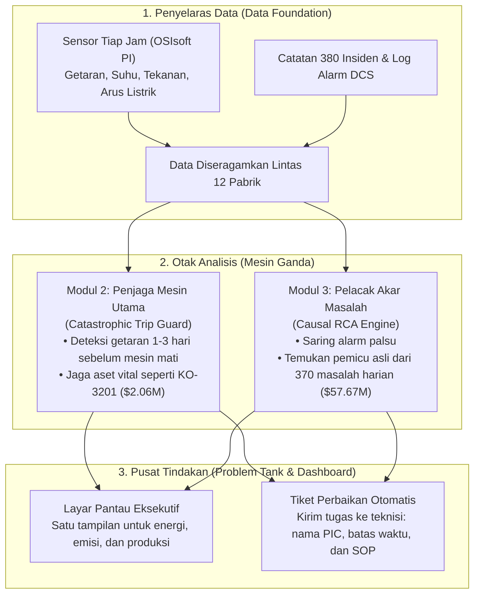

# Solusi Case 2: Causal Sentinel (Ringkasan Eksekutif)

Catatan praktis untuk proposal lomba CALIBER 2026 di PT Chandra Asri Pacific Tbk. Disusun to the point dan mudah dipahami.

---

## 1. Masalah utama kilang (SCQ singkat)

* **Situasi:** Pabrik Chandra Asri di Cilegon mengoperasikan 12 kompleks pabrik kimia. Setiap jam, ribuan sensor mencatat suhu, tekanan, getaran, dan aliran listrik ke dalam sistem OSIsoft PI.
* **Masalah:** Data resmi menunjukkan ada 380 insiden kerusakan yang memicu 2.261 jam pabrik berhenti beroperasi (downtime), dengan total kerugian mencapai $67,19 Juta. Masalah ini terbagi dua:
  1. *Masalah raksasa (Top 10 insiden):* Menyedot $9,52 Juta. Contohnya kompresor gas utama KO-3201 yang mati 32 jam dan rugi $2,06 Juta akibat pelumas rusak dan bantalan aus.
  2. *Masalah harian (370 insiden lainnya):* Menyedot $57,67 Juta. Ini kebocoran kecil pada pompa, motor, dan pipa yang terjadi hampir tiap hari. Titik paling boros ada di masalah kelas menengah senilai $200k sampai $500k (98 kasus senilai $30,31 Juta).
* **Tantangan:** Ruang kontrol sering kebanjiran alarm palsu. Teknisi bingung menentukan alat mana yang harus diperbaiki duluan, sementara mesin utama berisiko mati mendadak.
* **Solusi kita:** Causal Sentinel, sistem kecerdasan buatan terpadu yang bertugas mencegah mesin besar mati mendadak sekaligus mengotomasi penugasan perbaikan harian.

---

## 2. Cara kerja solusi (4 modul inti)

### Modul 1: Penyelaras data (Data Foundation)
* **Tugas:** Menarik data sensor tiap jam (getaran, suhu, tekanan, arus motor) dan riwayat insiden dari 12 pabrik.
* **Manfaat:** Menyamakan definisi data antar departemen Operasi, Perawatan, dan Manajemen, sehingga tidak ada lagi perdebatan laporan yang berbeda format.

### Modul 2: Penjaga mesin utama (Catastrophic Trip Guard)
* **Tugas:** Menjaga mesin vital tanpa cadangan, seperti kompresor gas KO-3201 ($2,06M) dan poros reaktor TX-5187B ($972k).
* **Cara kerja:** Menangkap keanehan pola getaran atau kenaikan suhu 1 sampai 3 hari (24 sampai 72 jam) sebelum sistem keamanan mematikan pabrik secara darurat.
* **Rujukan ilmiah:** Model deteksi anomali TimesNet ([`arXiv:2210.02186`](https://arxiv.org/abs/2210.02186)), Anomaly Transformer ([`arXiv:2110.02642`](https://arxiv.org/abs/2110.02642)), dan batasan fisika aman Stiff-PINN ([`arXiv:2011.04520`](https://arxiv.org/abs/2011.04520)).

### Modul 3: Pelacak akar masalah (Causal RCA Engine)
* **Tugas:** Menyelesaikan 370 masalah harian agar biaya tidak bocor terus-menerus.
* **Cara kerja:** Memilah alarm palsu dan mencari pemicu utamanya. Contoh: sistem bisa tahu bahwa alarm suhu motor berbunyi bukan karena motor rusak, melainkan karena saringan pipa oli di dekatnya tersumbat.
* **Rujukan ilmiah:** Model kausal Causally Guided Transformer ([`arXiv:2604.17998`](https://arxiv.org/abs/2604.17998)), agen penalar FaultExplainer ([`arXiv:2412.14492`](https://arxiv.org/abs/2412.14492)), dan pengujian proses kimia Tennessee Eastman Process ([`arXiv:2303.05904`](https://arxiv.org/abs/2303.05904)).

### Modul 4: Pusat tindakan (Problem Tank dan Dashboard)
* **Layar pantau eksekutif:** Menampilkan performa 12 pabrik dalam satu layar: konsumsi energi, emisi, laju produksi, dan status kesehatan mesin.
* **Tiket perbaikan otomatis:** Mengubah peringatan bahaya menjadi tiket kerja nyata. Teknisi langsung menerima pesan: nama alat yang rusak, penanggung jawab regu, batas waktu perbaikan (SLA), dan cara perbaikannya dari dokumen SOP resmi.

---

## 3. Fakta data kerugian kilang

| Kelompok Masalah | Jumlah Kasus | Total Kerugian | Kondisi Nyata di Lapangan | Solusi Sistem Kita |
| :--- | :---: | :---: | :--- | :--- |
| **Top 1 sampai 10 (Masalah Besar)** | 10 kasus | $9,52 Juta (14,2%) | Mesin utama rusak parah. Pabrik mati total 25 sampai 33 jam sekali kejadian. | Modul 2: Beri peringatan dini 1 sampai 3 hari sebelum mesin mati mendadak. |
| **Peringkat 11 sampai 50** | 40 kasus | $19,33 Juta (28,8%) | Kerusakan berat pada motor dan kipas besar. Waktu perbaikan 15 sampai 30 jam. | Modul 2 dan 3: Pantau keausan bantalan dan kelurusan poros secara rutin. |
| **Peringkat 51 sampai 150** | 100 kasus | $24,45 Juta (36,4%) | Seal pompa bocor, pipa penukar panas tersumbat kerak, produksi melambat. | Modul 3: Pasang alarm otomatis saat tekanan pipa mulai naik tidak wajar. |
| **Peringkat 151 sampai 380** | 230 kasus | $13,90 Juta (20,7%) | Masalah instrumen harian, getaran kecil, dan perbaikan dadakan. | Modul 3 dan 4: Saring alarm palsu dan jadwalkan perbaikan otomatis di Problem Tank. |

---

## 4. Contoh nyata dari 5 kasus resmi Chandra Asri

Data resmi investigasi Chandra Asri membuktikan bahwa masalah mereka selalu berakar dari pola yang jelas:

| Kode Alat | Jenis Alat | Masalah yang Terjadi | Kerugian | Akar Masalah dan Cara Sistem Mengatasinya |
| :--- | :--- | :--- | :---: | :--- |
| **KO-3201** | Kompresor Gas Utama | Mati mendadak karena getaran tinggi | $2.059.200 (32 jam) | Oli kotor merusak bantalan kompresor. Sistem kita membaca getaran getaran halus dan kualitas oli sebelum batas bahaya terlampaui. |
| **BL-5702** | Blower Serbuk Plastik | Mati karena getaran tinggi | $478.800 (14 jam) | Poros sambungan mesin miring 0,35 mm dan karet penyambung sudah getas. Sistem kita menangkap pola getaran poros yang tidak lurus. |
| **PM-4405B** | Motor Pompa Pendingin | Bantalan mesin kepanasan (>95°C) | $306.000 (18 jam) | Petugas memasukkan terlalu banyak gemuk pelumas saat servis rutin. Sistem kita mengukur getaran adukan pelumas dan memantau suhu motor. |
| **PU-2101B** | Pompa Bahan Kimia | Seal pengaman bocor | $184.800 (16 jam) | Saringan pipa pendingin tersumbat butiran plastik sehingga seal kepanasan. Sistem kita memicu alarm saat tekanan saringan mulai naik. |
| **HE-3301** | Penukar Panas Pipa | Pipa tersumbat kerak tebal | $183.600 (12 jam) | Kerak kokas menumpuk di dalam pipa karena jadwal cuci pipa selama ini cuma menebak tanggal kalender. Sistem kita memicu jadwal cuci pipa otomatis berdasarkan tekanan fluida. |

---

## 5. Nilai bisnis dan potensi penghematan (ROI)

* **Mencegah 1 kali kompresor utama mati:** Menyelamatkan kompresor KO-3201 dari trip = **$2,06 Juta**.
* **Mengurangi 25 persen kebocoran dari 370 masalah harian:** Memotong biaya perbaikan berulang senilai $57,67 Juta = **$14,4 Juta**.
* **Total potensi uang perusahaan yang diselamatkan:** Sekitar **$16,4+ Juta per tahun**.

---

## Related Notes
* [[references/05_official_casebook_caliber_2026|Buku Panduan Resmi CALIBER 2026]]
* [[incident_loss_report.html|Laporan Visual Interaktif Grafik Kerugian]]
* [[idea_steam_cracker_trip_canvas|Draf Ide Pencegahan Plant Trip]]
