# Laporan Lanskap Industri & Diagnostik Operasional Manufaktur Petrokimia
## Perspektif Manajemen Konsultansi (McKinsey, BCG, Bain & WEF Global Lighthouse) untuk Analisis Operasi & AI

**Kode Dokumen:** `SCC-CALIBER-REF-04-IND-LANDSCAPE`  
**Target Pembaca:** Azka Nabihan (Senior Computer Engineering Student & AI Strategist)  
**Konteks Kompetisi:** CALIBER 2026 — Strategic AI Masterplan (PT Chandra Asri Pacific Tbk / Sektor Petrokimia & Olefin)  
**Klasifikasi:** *Consulting-Grade Operational Diagnostics & First-Principles Engineering Primer*  
**Kerangka Epistemik:** `[FACT]` (Tolok ukur industri empiris, standar ASME/ISA/OSHA, hukum fisika/termodinamika, atau paper terbitan peer-reviewed/arXiv), `[ASSUMPTION]` (Heuristik operasional & parameter tipikal pabrik petrokimia kontinu), `[HYPOTHESIS]` (Ekstrapolasi analitis & proyeksi nilai transformasi digital).

---

## Daftar Isi
1. [Bab 1: Executive Summary & Hakikat Manufaktur Petrokimia Kontinu](#bab-1-executive-summary--hakikat-manufaktur-petrokimia-kontinu)
2. [Bab 2: Anatomi Fisik Pabrik & *Spread Economics* (Cara Pabrik Mencetak Uang)](#bab-2-anatomi-fisik-pabrik--spread-economics-cara-pabrik-mencetak-uang)
3. [Bab 3: Sakit Kepala Kronis Makro Operasional (*The Macro Headaches*)](#bab-3-sakit-kepala-kronis-makro-operasional-the-macro-headaches)
4. [Bab 4: Masalah Mikro Berdampak Makro (6 Gesekan Operasional Bernilai Jutaan Dolar)](#bab-4-masalah-mikro-berdampak-makro-6-gesekan-operasional-bernilai-jutaan-dolar)
5. [Bab 5: Dinamika Nilai AI Perspektif Top-Tier Konsultansi (McKinsey, BCG, Bain)](#bab-5-dinamika-nilai-ai-perspektif-top-tier-konsultansi-mckinsey-bcg-bain)
6. [Bab 6: Tolok Ukur *Global Lighthouse Plant* (World Economic Forum)](#bab-6-tolok-ukur-global-lighthouse-plant-world-economic-forum)
7. [Bab 7: Mental Model Diagnostik & Kamus Istilah Petrokimia Komprehensif](#bab-7-mental-model-diagnostik--kamus-istilah-petrokimia-komprehensif)

---

# Bab 1: Executive Summary & Hakikat Manufaktur Petrokimia Kontinu

## 1.1 Mengapa Industri Kimia Kontinu Berbeda Total dari Manufaktur Diskrit?

Bagi praktisi *computer engineering* dan *data science* yang terbiasa dengan manufaktur diskrit (perakitan otomotif, fabrikasi semikonduktor, atau perakitan elektronik), pabrik kimia kontinu sering disalahpahami sebagai sekadar "pabrik dengan banyak pipa". Padahal secara fundamental, dinamika fisika, kontrol, dan risikonya berada pada dimensi yang sepenuhnya berbeda.

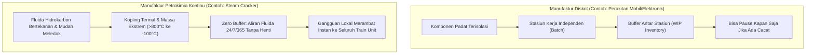

`[FACT]` **Perbedaan Intransigent Manufaktur Diskrit vs. Proses Kontinu:**
1. **Dinamika Aliran Tanpa Henti (24/7/365 Real-Time Flow):**
   - Dalam manufaktur diskrit, jika mesin las di stasiun A mengalami *glitch*, operator cukup menekan tombol jeda, memperbaiki baut, dan stok *Work-in-Process* (WIP) di stasiun B menjaga lini tetap berjalan.
   - Dalam pabrik petrokimia kontinu (*Steam Cracker* / *Olefins Plant*), fluida mengalir terus-menerus dengan laju puluhan hingga ratusan ton per jam. Tidak ada inventaris *buffer* di tengah kolom distilasi. Menjeda proses berarti memutus kesetimbangan termodinamika fasa cair-gas.
2. **Kopling Tertutup & *Recycle Loops* (*Tight Mass-Energy Coupling*):**
   - Pabrik petrokimia dirancang dengan efisiensi termal tinggi di mana panas buang dari pirolisis ($>800^\circ\text{C}$) digunakan untuk memanaskan uap bertekanan tinggi (*High-Pressure Steam*, 100 bar), yang kemudian memutar turbin kompresor gas retak (*Cracked Gas Compressor*), yang energinya mendinginkan fraksinasi kriogenik ($-100^\circ\text{C}$).
   - `[FACT]` Satu fluktuasi kecil sebesar 1% pada *reboiler steam* di ujung hilir akan merambat secara non-linear ke hulu dalam hitungan menit via *recycle stream*, menciptakan fenomena resonansi proses (*snowball effect*).
3. **Kondisi Batas Termodinamika Ekstrem:**
   - Bahan baku hidrokarbon (Naphtha, Propana, Etana) dipanaskan hingga $800^\circ\text{C} - 860^\circ\text{C}$ di dalam pipa paduan nikel-kromium (*furnace radiant tubes*) dengan waktu tinggal hanya 0.1 - 0.5 detik, lalu didinginkan secara mendadak (*quenched*) menjadi $200^\circ\text{C}$ dalam milidetik, sebelum masuk ke distilasi kriogenik pada $-100^\circ\text{C}$ dan tekanan 35 bar (`arXiv:2507.22640`).
4. **Toleransi Nol Terhadap Kegagalan (*Zero-Tolerance Process Safety*):**
   - Membuka katup yang salah atau membiarkan suhu melonjak $15^\circ\text{C}$ di atas batas metalurgi pipa tidak hanya menghasilkan produk cacat; hal ini berpotensi memicu ledakan fasa uap (*Vapor Cloud Explosion* / VCE) dan pelepasan racun hidrokarbon mematikan (`[FACT]` Standar OSHA 1910.119 / CCPS Process Safety).

## 1.2 Peta Perjalanan Transformasi Hidrokarbon

Untuk memahami letak setiap instrumen kontrol dan peluang AI, berikut adalah peta makro alur proses transformasi hidrokarbon dari bahan mentah hingga menjadi polimer plastik jadi:

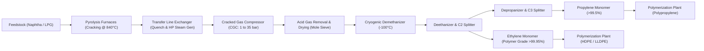

---

# Bab 2: Anatomi Fisik Pabrik & *Spread Economics* (Cara Pabrik Mencetak Uang)

## 2.1 Anatomi Rantai Nilai Fisik (*The Physical Value Chain*)

*Analogi Sederhana:* Bayangkan Anda mengelola dapur raksasa yang memecah rantai spageti panjang yang kusut (molekul hidrokarbon berat/Naphtha $\text{C}_5 - \text{C}_{10}$) menjadi potongan-potongan pendek yang sangat rapi dan seragam (Etilena $\text{C}_2\text{H}_4$ dan Propilena $\text{C}_3\text{H}_6$), lalu menyambung potongan seragam tersebut menjadi tali tambang plastik kuat (Polietilena dan Polipropilena).

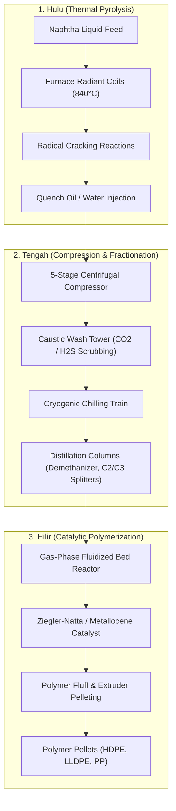

`[FACT]` **Rincian Tahapan Fisik Unit Petrokimia Utama:**

| Bagian Pabrik | Nama Unit Operasi | Parameter Operasi Kunci | Peran Fisik & Termodinamika | Risiko Kegagalan Utama |
| :--- | :--- | :--- | :--- | :--- |
| **Pyrolysis / Cracking** | *Cracking Furnaces* (8-12 sel tungku) | Suhu Keluar (*COT*): $820 - 860^\circ\text{C}$ Tekanan: $1.5 - 2.2\text{ bar}$ Waktu tinggal: $0.1 - 0.3\text{ s}$ | Memutus ikatan kovalen $\text{C}-\text{C}$ pada Naphtha menggunakan panas radiasi tinggi untuk menghasilkan olefin rantai pendek. | *Coking* pada dinding dalam pipa, *overheating tube*, *thermal runaway*. |
| **Quench Area** | *Transfer Line Exchanger* (TLE) & *Quench Tower* | Pendinginan instan dari $840^\circ\text{C} \to 200^\circ\text{C}$ dalam $<0.05\text{ s}$ | Menghentikan reaksi perengkahan sekunder agar olefin tidak terdegradasi menjadi tar/arang berat; membangkitkan uap 100 bar. | *Micro-fouling* TLE, penurunan koefisien transfer panas ($U$), penyumbatan viskositas tar. |
| **Compression** | *Cracked Gas Compressor* (CGC) | Kompresi 5 tahap ($1\text{ bar} \to 35\text{ bar}$) Daya turbin uap: $30 - 60\text{ MW}$ | Menaikkan tekanan gas hidrokarbon agar titik didih komponen naik sehingga dapat dipisahkan secara fraksinasi. | *Compressor surge*, getaran mekanis (*vibration trip*), *fouling* pada sudu rotor. |
| **Acid Gas Removal & Drying** | *Caustic Wash Tower* & *Molecular Sieve Dryers* | $\text{CO}_2 < 1\text{ ppm}$, $\text{H}_2\text{O} < 0.5\text{ ppm}$ | Menghilangkan gas asam ($\text{CO}_2, \text{H}_2\text{S}$) dan sisa air sebelum masuk area kriogenik agar tidak membentuk es. | *Hydrate/ice plugging* pada katup kriogenik, korosi asam, *foaming* kaustik. |
| **Fractionation (Cold Train)** | *Demethanizer, Deethanizer, C2 Splitter, C3 Splitter* | Suhu: $-100^\circ\text{C}$ hingga $+80^\circ\text{C}$ Baki kolom (*trays*): 80 - 140 tahap | Memisahkan komponen berdasarkan volatilitas relatif: $\text{CH}_4 \to \text{C}_2\text{H}_4 \to \text{C}_2\text{H}_6 \to \text{C}_3\text{H}_6 \to \text{C}_4+$. | *Column weeping/flooding*, *off-spec purity* ($<99.95\%$), pemborosan uap reboiler. |
| **Polymerization** | Reaktor Polietilena/Polipropilena (*Fluidized Bed / Loop*) | Suhu: $80 - 110^\circ\text{C}$ Tekanan: $20 - 35\text{ bar}$ Katalis Ziegler-Natta | Mereaksikan monomer gas menjadi polimer rantai panjang padat (pelet plastik) melalui polimerisasi radikal/koordinasi. | Pembentukan gumpalan (*sheeting/chunking*), hilangnya fluidisasi, *grade transition lag*. |

## 2.2 Persamaan Ekonomi & Dinamika *Crack Spread* (*How Plants Make Money*)

Bisnis petrokimia pada dasarnya adalah bisnis marjin komoditas dengan volume masif (*high-volume, thin-margin commodity processing*). Keuntungan finansial pabrik ditentukan oleh selisih harga antara produk jadi dengan bahan baku dan energi operasional:

$$\text{Petrochemical Cash Margin } (\$/\text{ton}) = P_{\text{Polymer/Monomer}} - \alpha \cdot P_{\text{Naphtha Feed}} - \beta \cdot P_{\text{Energy/Utilities}} - C_{\text{Fixed/Opex}}$$

Di mana:
- `[FACT]` $P_{\text{Polymer/Monomer}}$: Harga jual rata-rata tertimbang Etilena, Propilena, HDPE, LLDPE, dan PP di pasar spot regional (misal: ICIS CFR Southeast Asia).
- `[FACT]` $\alpha$: Koefisien konsumsi bahan baku. Untuk memproduksi 1 ton Etilena diperlukan sekitar $2.8 - 3.2$ ton Naphtha (tergantung efisiensi selektivitas tungku perengkahan).
- `[FACT]` $\beta$: Koefisien intensitas energi uap, listrik, dan bahan bakar gas (*Fuel Gas*) per ton produk.
- `[FACT]` $C_{\text{Fixed/Opex}}$: Biaya tenaga kerja, depresiasi aset modal, katalis, dan pemeliharaan terjadwal.

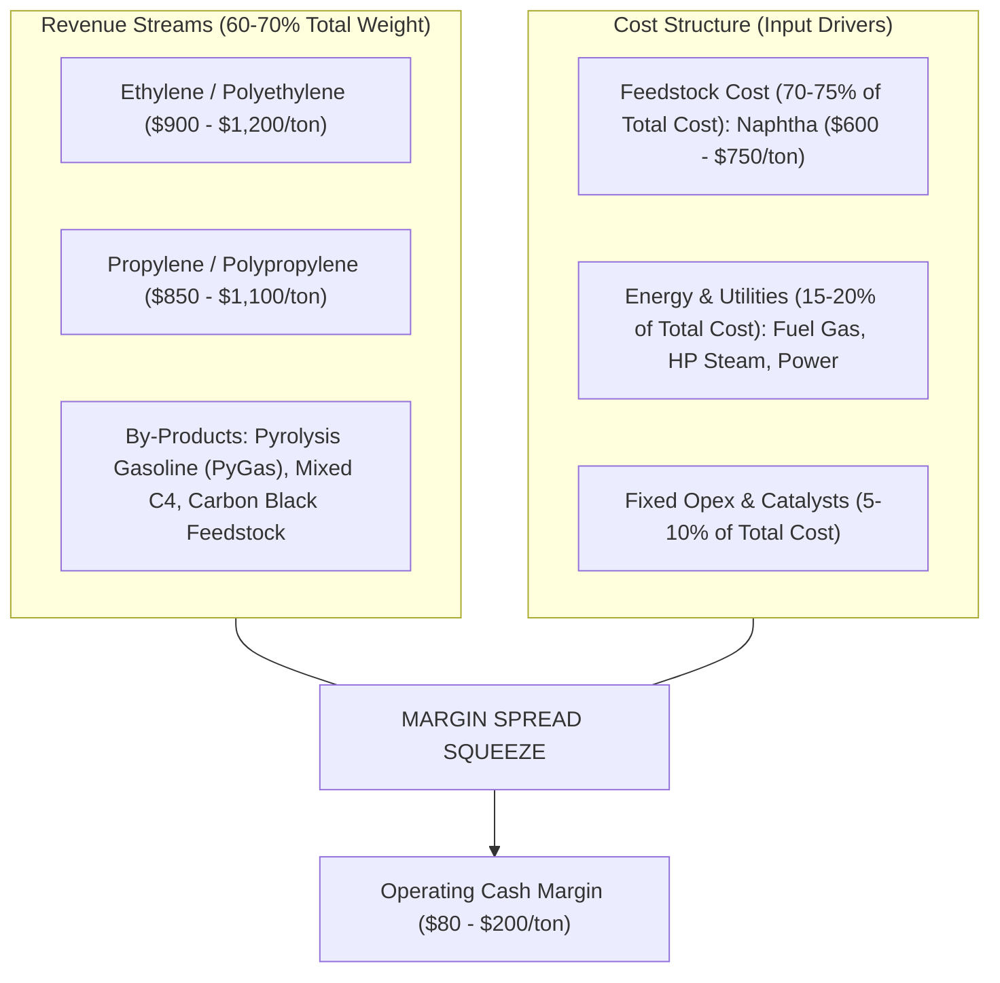

`[FACT]` **Sensitivitas Finansial Terhadap Utilisasi Aset:**
- Nilai investasi modal (*Capital Expenditure* / CapEx) pembangunan satu kompleks petrokimia terintegrasi berkisar antara **$1.5 Miliar hingga $5.0 Miliar USD** (misalnya proyek CAP2 Cilegon).
- `[FACT]` Dengan struktur biaya tetap yang sangat tinggi (*high fixed depreciation burden*), pabrik diwajibkan beroperasi pada tingkat utilisasi kapasitas (*Asset Utilization Rate*) **$>90 - 95\%$** secara nonstop 24 jam sehari selama 3 - 5 tahun di antara siklus *Turnaround* (pemeliharaan besar / TA).
- `[FACT]` Pada marjin kas tipis ($100 - $150/ton), efisiensi hasil konversi (*yield*) sekecil **0.5%** atau efisiensi konsumsi bahan bakar sebesar **1.0%** setara dengan perbedaan EBITDA tahunan sebesar **$15 Juta hingga $35 Juta USD** untuk pabrik berkapasitas 1 Juta ton Etilena per tahun.

---

# Bab 3: Sakit Kepala Kronis Makro Operasional (*The Macro Headaches*)

Bagi seorang *Plant General Manager* atau *VP of Manufacturing*, terdapat empat mimpi buruk operasional yang terus-menerus mengancam kinerja laba rugi dan keselamatan pabrik:

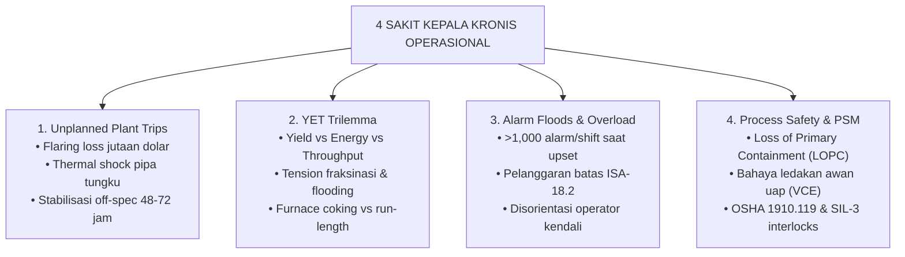

---

## 3.1 Sakit Kepala #1: Efek Domino *Unplanned Plant Trip* ($1.2M – $5.0M+ per Kejadian)

*Analogi Sederhana:* Mematikan pabrik petrokimia secara mendadak (*emergency trip*) bukan seperti mematikan saklar lampu di rumah, melainkan seperti menginjak rem mendadak pada kereta barang berkecepatan 200 km/jam yang bermuatan cairan kimia panas. Semua gerbong di belakangnya akan bertabrakan secara termal dan hidrolik.

`[FACT]` **Anatomi Biaya Kerugian Finansial Satu Insiden Trip (Kapasitas 1 Juta Ton/Tahun):**

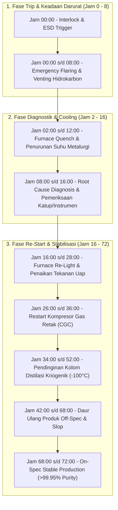

`[FACT]` **Rincian Kerugian Langsung & Tak Langsung Satu Insiden Trip:**
1. **Kehilangan Hidrokarbon via Flaring ($300k - $800k USD):**
   Saat kompresor utama atau reaktor trip, ratusan ton gas hidrokarbon bertekanan tidak boleh ditahan di dalam sistem karena tekanan akan melebihi batas desain bejana (*Overpressure Hazard*). Sistem *Emergency Depressuring* (EDP) membuka katup pelepas darurat ke *Flare Stack*, membakar hidrokarbon bernilai tinggi menjadi $\text{CO}_2$ dan air di udara terbuka semata-mata demi keselamatan.
2. **Kejutan Termal pada Metalurgi Pipa Tungku (*Thermal Shock* - $200k - $500k USD):**
   Pipa paduan nikel-kromium mikro (*radiant coil alloy*) yang beroperasi pada $850^\circ\text{C}$ mengalami penurunan suhu drastis saat umpan dihentikan. Kontraksi termal mendadak menyebabkan retak mikro (*micro-fissures*) pada sambungan las dan merontokkan lapisan kokas internal yang kemudian menyumbat *Transfer Line Exchanger* (TLE), mempercepat degradasi umur sisa pipa (*remaining useful life* / RUL).
3. **Produksi Tidak Sesuai Spesifikasi (*Off-Spec Quality / Slop Recycling* - $500k - $1.5M USD):**
   Diperlukan waktu 48 hingga 72 jam untuk memulihkan gradien suhu dan kesetimbangan uap-cair di seluruh rangkaian kolom distilasi. Selama fase stabilisasi ini, ribuan ton olefin yang dihasilkan memiliki kemurnian $<99.95\%$ (mengandung metana atau etana berlebih) dan terpaksa dijual dengan diskon besar sebagai *off-spec product* atau dibakar kembali sebagai bahan bakar tungku berharga murah.
4. **Hilangnya Peluang Margin Produksi (*Opportunity Loss* - $500k - $2.0M USD):**
   Kehilangan kapasitas produksi penuh selama 2 hingga 4 hari pada saat harga marjin tinggi menggerus laba bersih tahunan secara signifikan.

---

## 3.2 Sakit Kepala #2: *The Yield-Energy-Throughput (YET) Trilemma*

Para insinyur proses dan operator kendali setiap detik dihadapkan pada dilema optimasi multivariabel yang saling bertentangan:

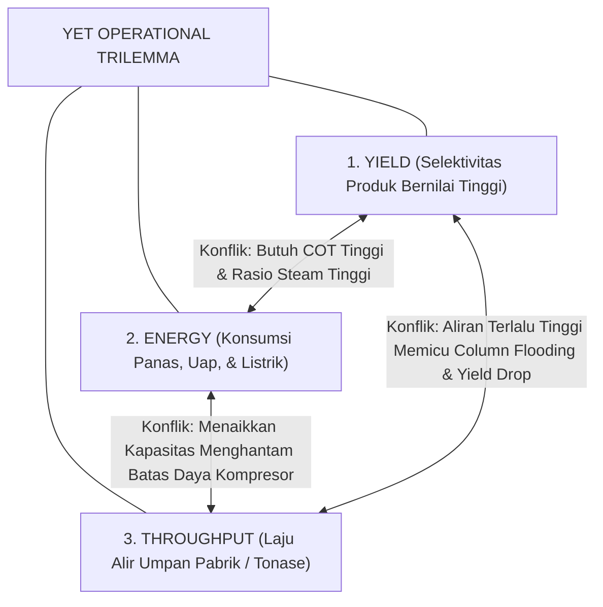

`[FACT]` **Mekanika Konflik Termodinamika YET:**
- **Mendorong Yield vs. Mengorbankan Energi:**
  Untuk meningkatkan hasil Etilena dari bahan baku Naphtha, suhu keluar tungku (*Coil Outlet Temperature* / COT) harus dinaikkan dari $835^\circ\text{C}$ ke $850^\circ\text{C}$ dan rasio injeksi uap pengencer (*Dilution Steam-to-Oil ratio*) dinaikkan. Hal ini membutuhkan pembakaran *fuel gas* ekstra di *burners* dan konsumsi uap superpanas masif.
- **Mendorong Throughput vs. Menabrak Batas Fisik (*Hydraulic Bottlenecks*):**
  Jika operator menaikkan laju umpan Naphtha sebesar 10% untuk memanfaatkan momentum harga pasar, beban uap pada kolom pemisah C2 (*C2 Splitter*) meningkat drastis. Jika laju uap melampaui batas kecepatan bebas (*flooding velocity*), cairan tertahan di baki atas (*liquid entrainment*), memicu banjir kolom (*column flooding*), merusak kemurnian polimer, dan berisiko memicu trip seluruh unit distilasi.
- **Biaya Ketidakpastian Operasional:** Karena fluktuasi cuaca ambient (siang-malam mempengaruhi efisiensi pendinginan kondensor) dan variasi kualitas bahan baku kapal Naphtha yang masuk, operator selalu mengoperasikan pabrik secara konservatif dengan margin keselamatan 3-5% di bawah kapasitas optimal (*sub-optimal operating buffer*).

---

## 3.3 Sakit Kepala #3: *Control Room Cognitive Overload & Alarm Floods*

*Analogi Sederhana:* Mengendalikan pabrik petrokimia saat terjadi gangguan proses (*plant upset*) ibarat menerbangkan pesawat jet komersial di tengah badai di mana 50 alarm merah berbunyi serentak setiap detik, kokpit dipenuhi suara sirine, dan pilot hanya memiliki waktu 60 detik untuk menentukan instrumen mana yang benar-benar rusak versus instrumen yang hanya ikut berbunyi karena efek domino.

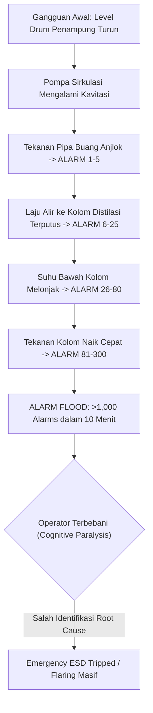

`[FACT]` **Standar Industri Internasional ANSI/ISA-18.2 vs. Realitas Lapangan:**
- `[FACT]` Standar **ANSI/ISA-18.2 (Management of Alarm Systems for the Process Industries)** menetapkan batas maksimum beban alarm yang dapat dikelola secara aman oleh seorang operator manusia adalah:
  - Rata-rata kondisi normal: **$< 1\text{ alarm per 10 menit}$** ($< 6\text{ alarm per jam}$).
  - Kondisi gangguan (*upset state*): **$< 10\text{ alarm dalam periode 10 menit pertama}$**.
- `[FACT]` **Realitas di Ruang Kendali Petrokimia Konvensional:**
  Saat terjadi gangguan pada unit kompresor atau tungku, sistem DCS sering memuntahkan **800 hingga 3.500 alarm dalam waktu kurang dari 15 menit**.
- `[FACT]` **Dampak Bencana Historis:**
  Investigasi resmi badan keselamatan AS (*US Chemical Safety Board* / CSB) pada tragedi ledakan kilang BP Texas City (15 korban jiwa) dan Esso Longford menunjukkan bahwa *alarm flooding* dan ketidakmampuan operator membedakan alarm akar penyebab (*root cause*) dari alarm gejala sekunder (*nuisance alarms*) menjadi pemicu langsung kegagalan mitigasi awal (`arXiv:2201.07748`, `arXiv:2412.14492`).

---

## 3.4 Sakit Kepala #4: Manajemen Keselamatan Proses (*Process Safety Management* / PSM)

Terdapat jurang konseptual mendasar antara Keselamatan Kerja Personal (*Personal Safety*) dan Keselamatan Proses (*Process Safety*):

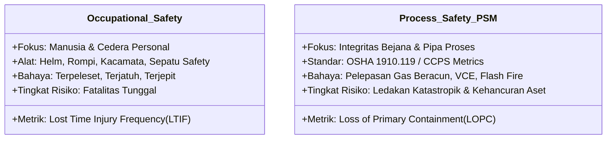

`[FACT]` **Prinsip Dasar OSHA 1910.119 & Lapisan Proteksi (*Layers of Protection Analysis* / LOPA):**
1. **Loss of Primary Containment (LOPC):** Sasaran utama PSM adalah mencegah kebocoran fluida hidrokarbon dari pipa, kolom, atau reaktor bertekanan.
2. **Prinsip Pertahanan Berlapis (*Defense-in-Depth*):**
   - *Lapisan 1 (BPCS - Basic Process Control System):* Pengendalian loop tertutup DCS otomatis standar (PID).
   - *Lapisan 2 (Operator Intervention):* Penanganan alarm kritis oleh operator sebelum batas trip tercapai.
   - *Lapisan 3 (SIS / ESD - Safety Instrumented System / SIL-3):* Logika trip independen berbasis PLC bersertifikasi keselamatan (misal: Triconex) yang memutus umpan secara otomatis tanpa campur tangan manusia.
   - *Lapisan 4 (Relief Devices):* Katup pelepas tekanan mekanis (*Pressure Safety Valve* / PSV) ke sistem *Flare*.

---

# Bab 4: Masalah Mikro Berdampak Makro (6 Gesekan Operasional Bernilai Jutaan Dolar)

Di luar gangguan skala besar, sumber kerugian finansial terbesar yang menggerus profitabilitas pabrik setiap hari berasal dari **6 friksi operasional mikro**—penurunan performa sub-optimal yang sering diabaikan karena tidak langsung memicu trip instan, namun terakumulasi menjadi pemborosan energi dan kerugian bahan baku bernilai jutaan dolar per tahun.

---

## 4.1 Gesekan Mikro #1: *Control Valve Stiction & Hysteresis*

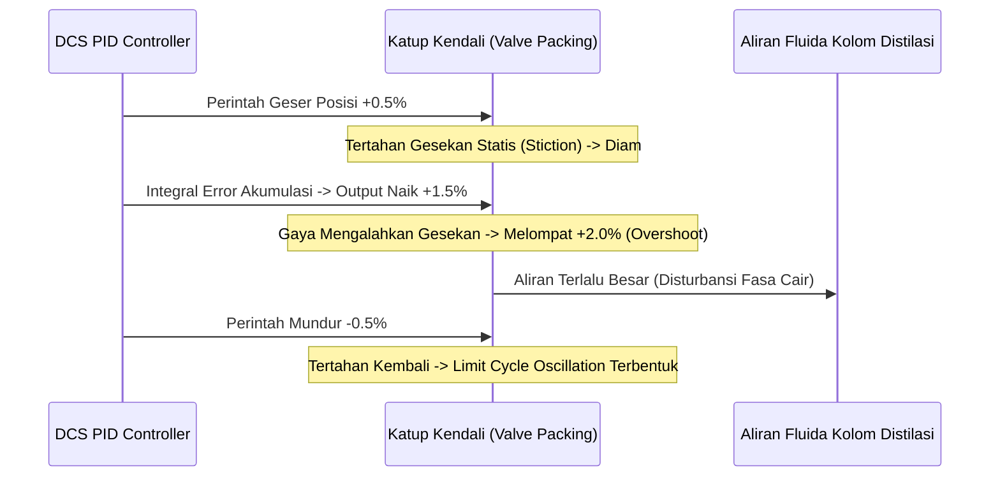

`[FACT]` **Intuisi & Analogi:**
Bayangkan mengemudikan mobil di mana setir kemudi terasa lengket dan seret. Ketika Anda ingin belok sedikit ke kanan, setir tidak bergerak; Anda memutar lebih kuat, dan tiba-tiba setir tersentak terlalu jauh ke kanan (*overshoot*). Anda mengoreksi ke kiri, setir macet lagi, lalu tersentak ke kiri. Mobil Anda berjalan zigzag di jalan raya secara permanen.

`[FACT]` **Mekanisme Fisik & Termodinamika:**
- Katup kendali (*control valve*) pneumatik menggunakan *stem packing* (PTFE atau grafit) untuk mencegah kebocoran fluida kimia bertekanan tinggi ke atmosfer.
- Akibat pengetatan berlebih, korosi, atau deposit kristal polimer, timbul gesekan statis (*static friction*) yang jauh melampaui gesekan dinamis. Fenomena ini disebut **Stiction** (*static friction + adhesion*).
- Ketika pengontrol PID di DCS mengirimkan sinyal koreksi kecil ($0.2\% - 0.5\%$), katup tidak merespons hingga akumulasi galat integral (*integral error*) menghasilkan gaya dorong aktuator yang cukup besar untuk membebaskan katup. Katup kemudian melompat secara tiba-tiba (*slip-jump*), melampaui nilai yang diinginkan (*overshoot*).
- Hal ini menciptakan gelombang osilasi berkelanjutan (*limit cycle oscillation*) dengan periode 5 hingga 30 menit yang merambat ke seluruh baki kolom distilasi (`arXiv:2502.18493`).

`[FACT]` **Dampak Kompon & Kuantifikasi Finansial:**
- **Derating Kapasitas Konservatif:** Karena level cairan dan kemurnian produk berosilasi $\pm 2\%$, operator terpaksa menggeser *setpoint* operasi 2-3% lebih jauh dari batas hidrolik optimal (*conservative back-off*), menurunkan total *throughput* pabrik.
- **Konsumsi Uap Reboiler Berlebih:** Untuk menjamin kemurnian Etilena tidak melanggar batas bawah ($99.95\%$) saat puncak osilasi negatif terjadi, operator memompa uap *reboiler* ekstra secara konstan.
- `[ASSUMPTION]` **Kerugian Finansial:** Pada kompleks Olefin berkapasitas 1 Juta ton, osilasi stiction pada 10 katup kritis fraksinasi menyebabkan pemborosan energi uap dan penalti *throughput* senilai **$1.8M – $3.2M USD per tahun**.

---

## 4.2 Gesekan Mikro #2: *Sensor Pyrometer Drift ($\pm 5^\circ\text{C}$)*

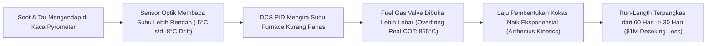

`[FACT]` **Intuisi & Analogi:**
Bayangkan termometer oven dapur Anda tertutup minyak tebal sehingga membaca suhu $190^\circ\text{C}$ padahal suhu sebenarnya sudah mencapai $205^\circ\text{C}$. Anda terus membesarkan api karena mengira oven kurang panas, akibatnya kue yang Anda panggang gosong dan hangus dalam waktu separuh dari yang seharusnya.

`[FACT]` **Mekanisme Fisik & Hukum Kinetika Kimia:**
- Suhu dinding pipa luar tungku (*Tube Metal Temperature* / TMT) dipantau menggunakan sensor inframerah optik (*pyrometer*) atau termokopel las.
- Selama siklus operasi berbulan-bulan, partikel jelaga (*soot*) dan asap pembakaran menempel pada jendela kuarsa optik pirometer, melemahkan intensitas radiasi inframerah yang diterima sensor. Hal ini menyebabkan sensor membaca suhu $5^\circ\text{C} - 8^\circ\text{C}$ lebih rendah dari kondisi fisik sebenarnya (*negative drift*).
- Menanggapi pembacaan semu ini, sistem kendali pembakaran otomatis (*Advanced Process Control* / APC) menyuntikkan bahan bakar gas ekstra (*over-firing*).
- Menurut hukum kinetika **Arrhenius**:

$$k_{\text{coking}} = A \cdot \exp\left(-\frac{E_a}{R \cdot T_{\text{film}}}\right)$$

- Di mana energi aktivasi pembentukan kokas ($E_a$) pada pirolisis hidrokarbon berkisar antara $180 - 220\text{ kJ/mol}$. Kenaikan suhu dinding film fluida sebesar **$10^\circ\text{C}$ melipatgandakan laju deposisi lapisan isolator kokas karbon padat ($k_{\text{coking}}$)** pada dinding dalam pipa baja paduan.

`[FACT]` **Dampak Kompon & Kuantifikasi Finansial:**
- **Pemotongan Masa Operasi Tungku (*Run-Length Reduction*):** Waktu operasi tungku di antara dua siklus pembersihan kokas (*decoking run-length*) anjlok dari target 60-70 hari menjadi hanya 28-35 hari.
- **Biaya Siklus Decoking:** Setiap kali tungku dimatikan untuk *steam-air decoking*, pabrik kehilangan kapasitas produksi tungku tersebut selama 36-48 jam, mengonsumsi uap tekanan tinggi, dan mempercepat penuaan termal pipa nikel.
- `[ASSUMPTION]` **Kerugian Finansial:** Untuk kompleks dengan 10 tungku perengkahan, *sensor drift* yang tidak terdeteksi menimbulkan biaya *decoking* tambahan dan kehilangan produksi olefin sebesar **$2.5M – $4.0M USD per tahun**.

---

## 4.3 Gesekan Mikro #3: *Steam Trap Leakage & Letdown Imbalance*

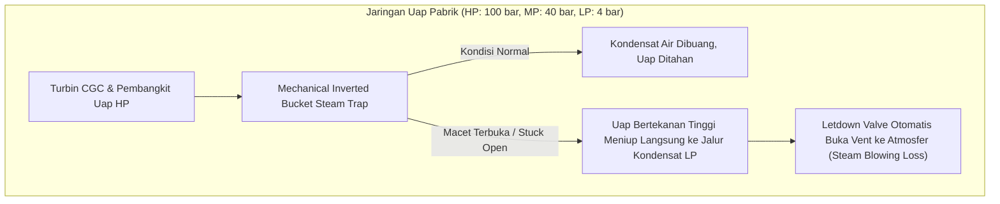

`[FACT]` **Intuisi & Analogi:**
*Steam trap* (perangkap uap) adalah katup otomatis yang bertindak seperti "pintu putar satu arah": ia harus membiarkan tetesan air kondensat dingin keluar dari pipa, tetapi harus menutup rapat saat gas uap panas lewat. Jika pintu putar ini rusak dan macet dalam posisi terbuka, uap panas bertekanan tinggi akan menyembur keluar nonstop layaknya ban truk yang tertancap paku besar.

`[FACT]` **Mekanisme Fisik & Dinamika Jaringan Uap (*Utility Balance*):**
- Pabrik petrokimia memiliki jaringan uap berlapis: *High-Pressure* (HP, 100 bar), *Medium-Pressure* (MP, 40 bar), dan *Low-Pressure* (LP, 4 bar), yang dihubungkan oleh ribuan *steam traps* (1.500 – 4.000 unit per kompleks).
- Karena korosi partikel magnetit atau keausan mekanis katup pelampung (*inverted bucket/thermodynamic disc*), rata-rata **15% hingga 22% dari total populasi steam trap di pabrik berada dalam kondisi rusak macet terbuka (*failed open/blowing*)**.
- Kebocoran ini meniup uap bersih bermutu tinggi langsung ke jalur pengembalian kondensat bertekanan rendah. Hal ini menciptakan ketidakseimbangan neraca uap (*steam header imbalance*), memicu pembukaan katup pelepas uap berlebih (*letdown/vent valve*) langsung ke atmosfer untuk mencegah tekanan balik pada turbin penggerak kompresor.

`[FACT]` **Dampak Kompon & Kuantifikasi Finansial:**
- `[FACT]` Satu unit *steam trap* ukuran 1 inci pada tekanan 40 bar yang bocor terbuka meniup uap sekitar **$150 - 250\text{ kg/jam}$**.
- `[FACT]` Dengan asumsi biaya produksi uap bersih (termasuk demineralisasi air dan pembakaran gas alam) sebesar **$25 - $35 per ton uap**, satu perangkap uap yang rusak membuang uang sebesar **$35.000 – $65.000 USD per tahun**.
- `[ASSUMPTION]` **Kerugian Finansial:** Pada pabrik dengan 300 trap yang bocor bersamaan, total pemborosan energi dan air demineralisasi mencapai **$2.0M – $4.5M USD per tahun**.

---

## 4.4 Gesekan Mikro #4: *Shift Handover Context Decay*

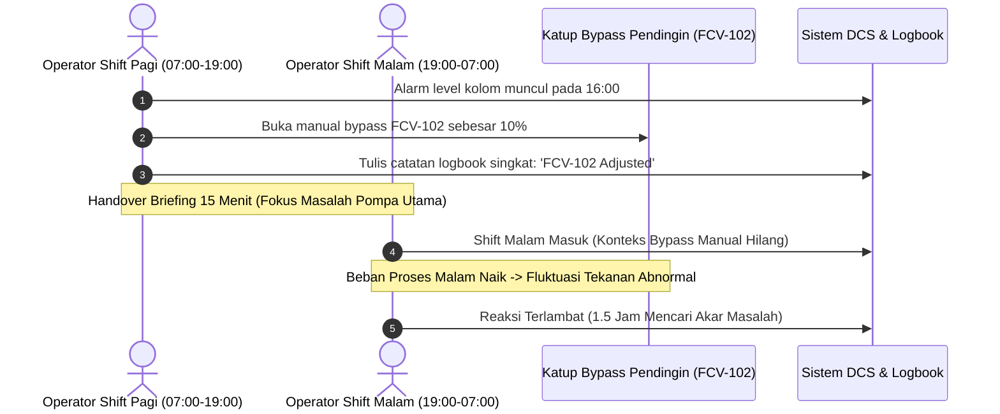

`[FACT]` **Intuisi & Analogi:**
Ibarat permainan pesan berantai bisik-bisik di mana kalimat panjang dan detail di awal ("*Katup bypass pendingin nomor 12 saya buka manual 10% karena pompa cadangan bergetar pada pukul 16:30*") terpangkas menjadi pesan teks 3 kata di buku catatan ("*Katup disesuaikan*"). Operator shift berikutnya tidak mengetahui intensi di balik tindakan tersebut dan mengira sistem berjalan otomatis.

`[FACT]` **Mekanisme Kegagalan Kognitif & Diskoneksi Informasi Lapangan:**
- Operasional pabrik 24/7/365 dibagi menjadi 2 atau 3 shift (shift 12 jam: Pagi 07:00-19:00, Malam 19:00-07:00).
- Selama shift berlangsung, operator lapangan sering melakukan penyesuaian darurat sementara (*temporary overrides*): mengunci katup tertentu pada posisi manual, memasang klem sementara (*hot tapping*), atau menonaktifkan alarm pengganggu (*alarm shelving/suppression*).
- `[FACT]` Format *logbook* konvensional masih berbasis teks manual atau kertas yang tidak terstruktur (*unstructured free-text log*). Waktu serah terima jabatan (*handover meeting*) hanya berlangsung 15-20 menit.
- Akibat kelelahan fisik di akhir shift (*fatigue*) dan ketiadaan integrasi data otomatis antara catatan logbook dengan histori tag sensor DCS, informasi kontekstual esensial hilang (*context decay*).

`[FACT]` **Dampak Kompon & Kuantifikasi Finansial:**
- **Peningkatan Waktu Diagnosa Gangguan (*Mean Time to Triage* / MTTR):** Saat terjadi lonjakan tekanan pada shift malam, operator baru membutuhkan waktu 45 hingga 120 menit hanya untuk menyadari bahwa ada bypass manual terbuka yang belum dikembalikan ke posisi otomatis.
- **Pemicu Trip Darurat:** Dalam skenario terburuk, respon lambat akibat miskomunikasi saat serah terima shift memicu aktivasi interlock keselamatan darurat (*ESD Trip*).
- `[ASSUMPTION]` **Kerugian Finansial:** Penurunan efisiensi operasional dan 1-2 insiden trip tahunan yang berakar dari degradasi konteks serah terima shift menyumbang kerugian **$1.5M – $3.5M USD per tahun** (`arXiv:2603.22528`, `arXiv:2606.03812`).

---

## 4.5 Gesekan Mikro #5: *Polymer Grade Transition Inertia*

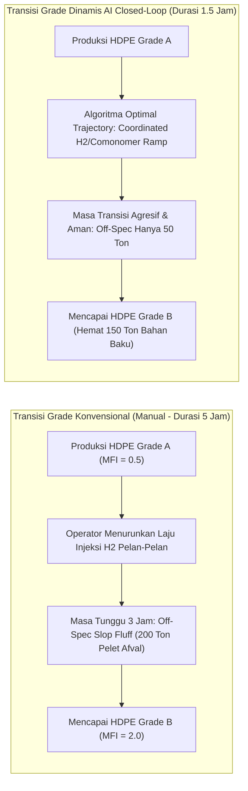

`[FACT]` **Intuisi & Analogi:**
Ibarat mengganti jenis adonan kue di pabrik biskuit berjalan: dari adonan biskuit cokelat manis ke biskuit gandum asin. Jika Anda sangat takut pipa adonan tersumbat, Anda mencuci pipa dengan sangat lambat dan membiarkan adonan campur aduk mengalir ke tempat sampah selama berjam-jam sebelum berani mencetak biskuit gandum murni.

`[FACT]` **Mekanisme Fisik & Fenomena *Reactor Chunking*:**
- Reaktor polimerisasi fasa gas (*Gas-Phase Fluidized Bed Reactor*, misal teknologi Unipol) memproduksi berbagai jenis mutu (*grade*) polimer dengan mengubah indeks leleh (*Melt Flow Index* / MFI) dan densitas melalui variasi rasio gas Hidrogen ($\text{H}_2/\text{C}_2$) dan rasio komonomer (Butena/Heksena terhadap Etilena).
- Jika operator mengubah rasio gas terlalu cepat, distribusi berat molekul menjadi sangat lebar secara lokal, menyebabkan serbuk polimer menjadi lengket (*sticky polymer particles*). Partikel lengket ini menempel pada dinding reaktor (*sheeting*) dan menggumpal menjadi batu plastik besar (*chunking/clogging*), yang dapat mematikan sirkulasi unggun fluida dan memaksa reaktor dibongkar manual selama berminggu-minggu.
- Karena trauma terhadap risiko *reactor chunking*, operator lapangan sengaja melakukan perubahan rasio reaktan secara sangat bertahap dan lambat (*ultra-conservative ramp rate*), memperpanjang waktu transisi dari yang secara termodinamika teoritis hanya butuh 1.5 jam menjadi **4 hingga 6 jam**.

`[FACT]` **Dampak Kompon & Kuantifikasi Finansial:**
- **Produksi Polimer Cacat (*Off-Spec Scrap/Transition Fluff*):** Selama jendela transisi 5 jam, reaktor menghasilkan **150 hingga 300 ton polimer campuran** yang tidak memenuhi standar mutu Grade A maupun Grade B. Polimer afval ini harus dijual rugi sebagai *scrap/near-prime* dengan potongan harga $300 - $500 per ton di bawah harga pasar.
- `[ASSUMPTION]` **Kerugian Finansial:** Pabrik polietilena rata-rata melakukan 40 hingga 60 kali pergantian grade per tahun. Akumulasi kerugian nilai material transisi mencapai **$3.0M – $6.5M USD per tahun**.

---

## 4.6 Gesekan Mikro #6: *Heat Exchanger Micro-Fouling pada TLE*

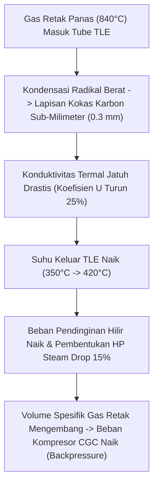

`[FACT]` **Intuisi & Analogi:**
Bayangkan kerak kapur dan jelaga tipis (setebal kartu ATM) melapisi bagian bawah ketel air panas Anda. Air membutuhkan waktu lebih lama untuk mendidih, kompor Anda membakar lebih banyak gas, dan uap yang dihasilkan berkurang drastis sementara dapur Anda menjadi sangat panas karena panasnya terbuang ke ruangan alih-alih masuk ke dalam air.

`[FACT]` **Mekanisme Termodinamika & Persamaan Transfer Panas:**
- *Transfer Line Exchanger* (TLE) adalah penukar panas tipe cangkang dan tabung (*shell-and-tube heat exchanger*) yang dipasang persis di outlet tungku perengkahan untuk mendinginkan gas retak dari $840^\circ\text{C}$ menjadi $<380^\circ\text{C}$ secara instan sekaligus mendidihkan air menjadi uap jenuh bertekanan tinggi (*Very High Pressure Steam*, 100 bar).
- Persamaan dasar laju perpindahan panas:

$$Q = U \cdot A \cdot \Delta T_{\text{LM}}$$

- Di mana koefisien transfer panas keseluruhan ($U$) ditentukan oleh tahanan termal fouling ($R_f$):

$$\frac{1}{U} = \frac{1}{h_i} + \frac{1}{h_o} + \frac{x_w}{k_w} + R_{f,\text{coke}}$$

- Meskipun ketebalan lapisan kokas karbon ($x_{\text{coke}}$) hanya **$0.2 - 0.5\text{ mm}$**, konduktivitas termalnya sangat rendah ($k_{\text{coke}} \approx 0.5 - 1.5\text{ W/m}\cdot\text{K}$ dibandingkan baja pipa $k_{\text{steel}} \approx 45\text{ W/m}\cdot\text{K}$).
- Tahanan termal ini menyebabkan penurunan nilai $U$ sebesar 20-35%, menaikkan suhu gas keluar TLE dari $350^\circ\text{C}$ ke $>420^\circ\text{C}$.

`[FACT]` **Dampak Kompon & Kuantifikasi Finansial:**
- **Penurunan Pembangkitan Uap Bertekanan Tinggi (HP Steam Loss):** Setiap penurunan efisiensi transfer panas di TLE memangkas produksi uap 100 bar yang seharusnya menggerakkan turbin kompresor gas retak.
- **Kenaikan Tekanan Balik Kompresor (*Compressor Suction Backpressure*):** Gas yang keluar dari TLE pada suhu lebih tinggi memiliki densitas lebih rendah (volume spesifik lebih besar), memaksa kompresor gas retak (*Cracked Gas Compressor*) bekerja pada batas beban maksimum, membatasi kapasitas perengkahan hulu.
- `[ASSUMPTION]` **Kerugian Finansial:** Pada satu train cracker, micro-fouling TLE menyebabkan penurunan efisiensi energi uap dan keterbatasan throughput senilai **$2.0M – $3.8M USD per tahun**.

---

# Bab 5: Dinamika Nilai AI Perspektif Top-Tier Konsultansi (McKinsey, BCG, Bain)

Tiga firma manajemen konsultansi global terkemuka (McKinsey & Company, Boston Consulting Group / BCG, dan Bain & Company) bersama Forum Ekonomi Dunia (*World Economic Forum* / WEF) telah memetakan dinamika penciptaan nilai digital dan penyebab utama mengapa banyak inisiatif AI di industri proses manufaktur berakhir dengan kegagalan.

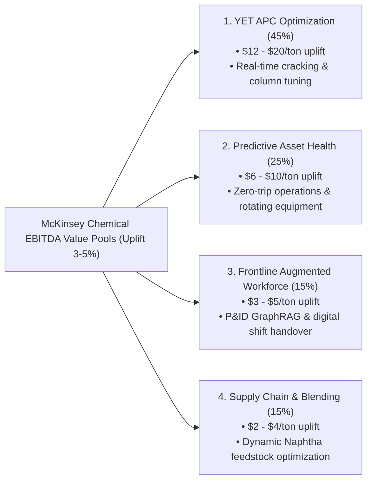

---

## 5.1 McKinsey Chemicals Practice: *EBITDA Value Pools* (Peluang Uplift 3-5%)

`[FACT]` Riset mendalam dari **McKinsey Chemicals Practice** (publikasi: *The digital chemical plant of the future*, 2022-2025) menunjukkan bahwa adopsi AI dan analitik tingkat lanjut di kompleks petrokimia kontinu mampu membuka peningkatan EBITDA sebesar **$15 hingga $35 USD per ton produk** (setara dengan kenaikan margin EBITDA bersih sebesar **$3\% - 5\%$**).

`[FACT]` **Empat Kolam Nilai (*Value Pools*) Utama:**
1. **Dynamic Real-Time YET Optimization ($12 - $20/ton):**
   Penggantian sistem APC linier konvensional dengan *Physics-Informed Neural Networks* (PINN) dan *Reinforcement Learning* adaptif untuk mengoptimalkan rasio injeksi uap tungku dan kesetimbangan baki kolom distilasi berdasarkan harga bahan bakar gas dan tarif listrik *real-time* (`arXiv:2011.04520`, `arXiv:2507.22640`).
2. **Predictive Asset Integrity & Zero-Trip Operations ($6 - $10/ton):**
   Pendeteksian anomali multivariat berbasis *Deep Learning* (*Anomaly Transformer / TimesNet*) pada data streaming sensor DCS 1 Hz untuk mendeteksi degradasi mekanis kompresor, kavitasi pompa, dan stiction katup 4 hingga 24 jam sebelum batas interlock darurat terlampaui (`arXiv:2110.02642`, `arXiv:2210.02186`).
3. **Frontline Operator Cognitive Copilots & Vision RAG ($3 - $5/ton):**
   Pemberdayaan insinyur proses dan operator kendali dengan sistem *Retrieval-Augmented Generation* (RAG) berbasis graf topologi P&ID (*GraphRAG*) yang mampu menelusuri rute isolasi katup, mendiagnosa alarm dalam hitungan detik, dan mengotomatisasi telaah dokumen HAZOP (`arXiv:2411.13929`, `arXiv:2603.22528`).
4. **Feedstock Blending & Supply Chain Optimization ($2 - $4/ton):**
   Prediksi titik embun dan komposisi fraksi Naphtha secara dinamis (*soft-sensors*) untuk mengoptimalkan pencampuran bahan baku dari kapal tanker sebelum masuk ke tungku.

---

## 5.2 Aturan Transformasi "10-20-70" dari BCG (*Boston Consulting Group*)

Salah satu wawasan terpenting dari BCG dalam transformasi digital industri berat adalah **Aturan 10-20-70**:

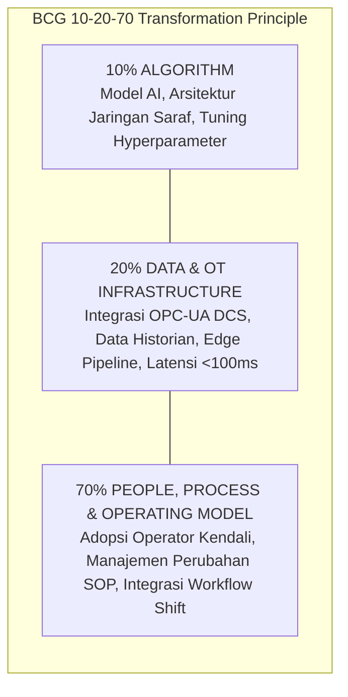

`[FACT]` **Mengapa 80% Inisiatif AI Petrokimia Gagal di Tahap Pilot (*Pilot Purgatory*)?**
- **Kesalahan Fokus pada Algoritma (The 10% Trap):**
  Banyak tim data science menghabiskan 90% waktu mereka untuk menyempurnakan akurasi algoritma di lingkungan cloud terisolasi (Jupyter Notebook), namun mengabaikan kenyataan bahwa model tersebut tidak dapat membaca data sensor secara *real-time* dari DCS pabrik karena kendala *firewall* keamanan OT.
- **Ketiadaan Kepercayaan dari Operator Ruang Kendali (Operator Distrust):**
  Operator kendali yang telah bekerja selama 20 tahun tidak akan pernah menuruti rekomendasi setpoint dari model AI berpenampilan "kotak hitam" (*black-box model*) jika mereka tidak memahami dasar fisika di balik saran tersebut. Jika satu rekomendasi AI pernah menyebabkan ketidakstabilan proses, operator akan menonaktifkan (*bypass*) sistem AI tersebut selamanya.
- **Kegagalan Mengubah Standard Operating Procedure (SOP):**
  Model AI secanggih apa pun tidak akan menghasilkan dampak finansial jika peringatan dini anomali tidak terhubung secara otomatis ke sistem tiket pemeliharaan (*SAP Plant Maintenance / Maximo*) dan tidak ada mekanisme tindak lanjut terikat waktu bagi teknisi lapangan.

---

## 5.3 Melepaskan Diri dari *Pilot Purgatory*: Strategi Eksekusi *Cross-Functional Agile Squads*

`[FACT]` Pendekatan Bain & Company dan McKinsey untuk keluar dari jebakan pilot adalah mendesentralisasi pengembangan AI ke dalam unit-unit kecil multidisiplin (*Agile Transformation Squads*):

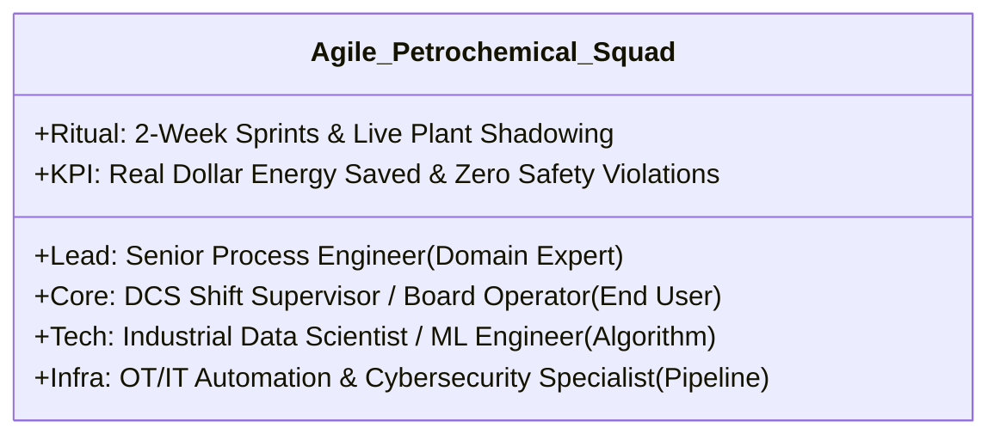

- **Prinsip Squad:** Tim tidak dibentuk secara silo di kantor pusat (*HQ Data Lab*), melainkan ditempatkan langsung di ruang kendali pabrik (*onsite control room*). Setiap algoritma yang dikembangkan harus diuji bersama operator shift untuk memastikan rekomendasi dapat dieksekusi secara aman dalam koridor proteksi SIL-3.

---

# Bab 6: Tolok Ukur *Global Lighthouse Plant* (World Economic Forum)

Forum Ekonomi Dunia (*World Economic Forum* / WEF) bekerja sama dengan McKinsey mengurasi jaringan pabrik manufaktur terdepan di dunia (*Global Lighthouse Network*) yang telah berhasil mengimplementasikan teknologi Industri 4.0 dalam skala penuh dan mencetak hasil finansial nyata.

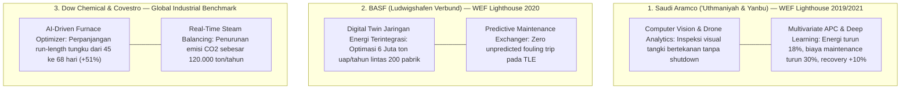

`[FACT]` **Ringkasan Komparasi Tolok Ukur Implementasi Nyata di Lapangan:**

| Nama Kompleks / Operator | Wilayah & Fasilitas | Fokus Solusi AI / Industri 4.0 | Dampak Operasional & Finansial Terverifikasi |
| :--- | :--- | :--- | :--- |
| **Saudi Aramco** (`[FACT]` WEF Lighthouse 2019/2021) | Fasilitas Gas 'Uthmaniyah & Kompleks Pengilangan Yanbu | • *Advanced Process Control* bertenaga deep learning pada kolom fraksinasi. • Inspeksi drone otonom & Computer Vision untuk korosi pipa. • *Predictive valve leak detection*. | • **Pemotongan biaya pemeliharaan sebesar 20 - 30%**. • **Peningkatan pemulihan hidrokarbon sebesar 10%**. • Penurunan konsumsi energi sebesar **18%**. • Waktu inspeksi tangki terpangkas dari 3 hari menjadi 4 jam. |
| **BASF SE** (`[FACT]` WEF Lighthouse 2020) | Ludwigshafen Verbund Complex, Jerman (10 $\text{km}^2$ integrated site) | • *Digital Twin* terintegrasi untuk jaringan distribusi uap & listrik lintas 200 pabrik. • Model prediktif micro-fouling pada penukar panas TLE. • *Cognitive assistant* untuk diagnosa lab QC. | • Penghematan uap industri bernilai **jutaan Euro per tahun**. • Eliminasi insiden *unplanned exchanger fouling shut-in* secara total. • Peningkatan efisiensi energi terintegrasi sebesar **3.5%**. |
| **Dow Chemical & Covestro** (`[FACT]` Global Benchmark) | Texas Operations (Dow) & Antwerp Verbund (Covestro) | • Algoritma optimasi pembakaran tungku dinamis berbasis *Physics-Informed AI*. • Otomatisasi transisi grade polimer loop tertutup. • Sistem manajemen alarm prediktif berbasis graf dependensi kausal. | • Perpanjangan masa operasi tungku perengkahan (*run-length*) dari rata-rata **45 hari menjadi 68 hari (+51%)**. • Penurunan produksi polimer *off-spec* saat transisi grade sebesar **40%**. • Pengurangan alarm palsu sebesar **65%**. |

---

# Bab 7: Mental Model Diagnostik & Kamus Istilah Petrokimia Komprehensif

## 7.1 Mental Model 4 Pertanyaan Diagnostik Sistemik

Ketika seorang konsultan operasi atau arsitek sistem AI memeriksa unit pabrik petrokimia yang bermasalah, gunakan **Kerangka 4 Pertanyaan Utama** berikut untuk membedah akar permasalahan secara terstruktur (MECE):

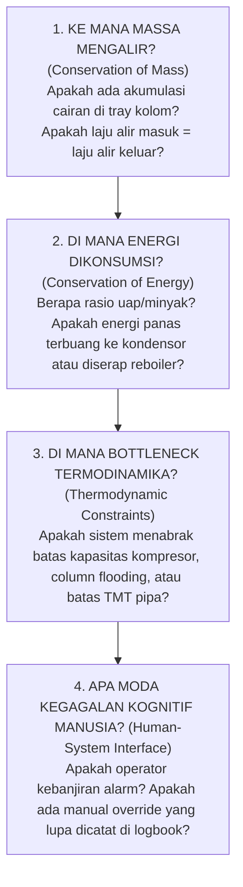

---

## 7.2 Kamus Istilah Petrokimia & Otomasi Industri Komprehensif

Berikut adalah glosarium istilah teknis esensial yang wajib dikuasai untuk analisis petrokimia kelas industri:

1. **Crack Spread:** Selisih nilai moneter antara harga jual produk olefin/polimer olahan dengan harga beli bahan baku minyak mentah/Naphtha mentah.
2. **Cash Margin:** Laba operasional per ton produk setelah dikurangi seluruh biaya tunai variabel (bahan baku, uap, listrik, bahan bakar, katalis).
3. **Pyrolysis (Steam Cracking):** Proses dekomposisi termal rantai hidrokarbon panjang menjadi rantai pendek pada suhu tinggi ($>800^\circ\text{C}$) dengan bantuan uap pengencer.
4. **Coil Outlet Temperature (COT):** Suhu campuran hidrokarbon dan uap tepat pada titik keluar pipa radiasi tungku perengkahan; parameter utama pengendali selektivitas reaksi.
5. **Tube Metal Temperature (TMT):** Suhu fisik dinding luar pipa logam paduan di dalam tungku; batasan metalurgi kritis untuk mencegah deformasi atau pecah pipa.
6. **Run-Length:** Durasi waktu operasi terus-menerus sebuah tungku perengkahan atau reaktor sebelum harus dimatikan untuk pembersihan lapisan kokas (*decoking*).
7. **Decoking:** Prosedur pembersihan lapisan deposit karbon padat (kokas) dari dinding dalam pipa tungku menggunakan hembusan campuran uap udara bersuhu tinggi.
8. **Transfer Line Exchanger (TLE):** Penukar panas khusus yang mendinginkan gas hasil perengkahan secara instan dalam hitungan milidetik untuk membangkitkan uap bertekanan tinggi (100 bar).
9. **Cracked Gas Compressor (CGC):** Kompresor sentrifugal multi-tahap raksasa bertenaga puluhan megawatt yang menaikkan tekanan gas hidrokarbon dari 1 bar ke 35 bar.
10. **Demethanizer:** Kolom distilasi kriogenik bersuhu sangat rendah (hingga $-100^\circ\text{C}$) yang memisahkan gas metana dan hidrogen dari hidrokarbon $\text{C}_2+$.
11. **C2 Splitter:** Kolom fraksinasi raksasa dengan $>100$ baki yang memisahkan Etilena (titik didih $-103.7^\circ\text{C}$) dari Etana (titik didih $-88.6^\circ\text{C}$) hingga mencapai kemurnian *polymer-grade* ($>99.95\%$).
12. **C3 Splitter:** Kolom distilasi yang memisahkan Propilena dari Propana untuk menghasilkan monomer propilena dengan kemurnian tinggi ($>99.5\%$).
13. **Overall Equipment Effectiveness (OEE):** Metrik gabungan efisiensi manufaktur yang mengalikan ketersediaan aset (*Availability*), kecepatan kinerja (*Performance*), dan rasio mutu (*Quality*).
14. **YET Optimization:** Optimasi simultan antara tiga variabel yang saling berkompromi: Hasil Produk (*Yield*), Konsumsi Energi (*Energy*), dan Laju Alir Produksi (*Throughput*).
15. **Valve Stiction:** Gesekan statis mekanis pada batang katup kendali yang menyebabkan hambatan gerak, lonjakan tiba-tiba, dan osilasi siklus tertutup (*limit cycles*).
16. **Distributed Control System (DCS):** Sistem komputerisasi terdistribusi yang memantau dan mengendalikan ribuan loop instrumen di seluruh pabrik secara *real-time* (misal: Yokogawa CENTUM, Honeywell Experion, Emerson DeltaV).
17. **Process Historian:** Basis data deret waktu (*time-series database*) berkecepatan tinggi yang menyimpan riwayat pembacaan sensor selama bertahun-tahun (misal: AVEVA PI System / OSIsoft PI, Aspen InfoPlus.21).
18. **Piping and Instrumentation Diagram (P&ID):** Gambar skema teknik detail yang memetakan seluruh pipa, bejana, instrumen sensor, katup, dan loop kendali di pabrik.
19. **Process Safety Management (PSM):** Kerangka regulasi kepatuhan keselamatan (OSHA 1910.119) untuk mencegah pelepasan fluida hidrokarbon berbahaya beracun atau mudah meledak.
20. **Emergency Shutdown System (ESD / SIS):** Sistem instrumen keselamatan independen berperingkat SIL-3 yang mematikan unit secara otomatis jika variabel proses melanggar batas bahaya katastropik.
21. **Safety Integrity Level (SIL):** Tingkat keandalan target keselamatan instrumen; SIL-3 mensyaratkan probabilitas kegagalan saat diminta (*Probability of Failure on Demand*) antara $10^{-4}$ hingga $10^{-3}$.
22. **Management of Change (MOC):** Prosedur formal ketat yang wajib dilalui sebelum melakukan perubahan fisik pada pipa, instrumen, atau parameter konfigurasi kontrol pabrik.
23. **Flare Stack:** Menara pembakar vertikal berujung api pilot yang digunakan untuk membakar kelebihan gas hidrokarbon bertekanan secara aman selama keadaan darurat atau trip pabrik.
24. **Loss of Primary Containment (LOPC):** Peristiwa lolosnya fluida kimia atau hidrokarbon dari wadah penampung utamanya (tangki, pipa, reaktor) ke lingkungan bebas.

---

## Related Notes & Graph Backlinks
* **Master Strategy Hub:** `[[00_executive_reference_matrix.md]]`
* **Plant Knowledge Hub (P&ID & GraphRAG):** `[[01_arxiv_knowledge_hub_pid_rag.md]]`
* **Manufacturing Intelligence (TSAD & RCA):** `[[02_arxiv_manufacturing_intel_rca.md]]`
* **Physics-Informed Neural Networks & APC:** `[[03_arxiv_pinn_process_control.md]]`
* **Idea & Architecture Canvas:** `[[idea_steam_cracker_trip_canvas.md]]`
